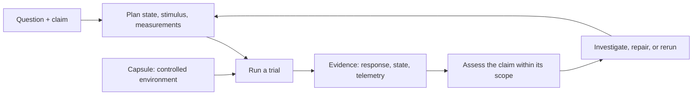

<p align="center">
  
</p>

<h1 align="center">Suites - Blackbox</h1>

**A system testing and runtime verification framework for developers and coding agents.**

A request can return the expected response while the system makes an unexpected downstream call or writes the wrong
state. Blackbox helps you investigate that behavior by running your application in an isolated environment and
keeping the actions you performed alongside observations from the running system.

Use it to reproduce a bug, explore an unfamiliar service, test a behavioral claim, or give a coding agent evidence
to work with. Define the question and conditions, exercise the application, and assess what the execution establishes.
Blackbox helps you construct a **verification machine**: an environment that makes system behavior easier to check.

> **Alpha preview:** Blackbox is being developed in public and has not been published to npm. Install from source.
> APIs and formats may change. Playwright integration is in progress. See [alpha availability](docs/alpha-status.md).

## Investigate a real system

Blackbox works with an application or subsystem you define in a YAML catalog. The catalog describes its services,
dependencies, entrypoint, and instrumentation; Docker Compose provides the environment.

A **Capsule is the laboratory**: the controlled environment, execution tools, observation infrastructure, and retained
record. An **experiment** is the procedure you carry out there: known initial state, a deliberate stimulus, measurements,
and criteria for answering a question. One execution of that procedure is a **trial**.

You can send HTTP requests, prepare data, inspect a database, or trigger a worker using tools such as `curl`, `psql`,
and `redis-cli`. Blackbox records these commands as activities and collects supported runtime observations through
OpenTelemetry. The [verification model](docs/verification-machine.md) explains how these parts fit together.



This supports a **feedback loop**, like flight control: act, measure, compare with the intended behavior, and adjust.
The Capsule supplies the controlled environment and operating tools; explicit checks make the evidence actionable.
You can [reduce the system under test](docs/configuration.md#reduce-the-system-under-test) to focus an investigation,
use [drivers to seed data or run migrations](docs/drivers.md#seed-data-and-run-migrations), then rerun after a change.

For example, investigating subscription creation can involve three distinct pieces of evidence:

| Question                     | What to inspect                                                               |
| ---------------------------- | ----------------------------------------------------------------------------- |
| What did the caller receive? | The HTTP client's response and exit result.                                   |
| Which services participated? | The instrumented application's traces.                                        |
| What state was saved?        | A database query or application state endpoint, recorded as another activity. |

Each piece answers a different question. Blackbox keeps their identities and results available so you can follow
a finding back to its evidence. A response or state read can be useful evidence even without a connected trace.
An asynchronous handoff can also break trace continuity while the work continues. The [Redis walkthrough](docs/async-workflows.md)
shows Blackbox retaining both the command execution and a consumer's separate downstream trace in one session.

Execution identity defines the evidence scope. Known state and isolation reduce alternative explanations; trace
propagation adds structure inside that scope. Claims about occurrence, absence, or exact counts require different
levels of evidence. A finding can be supported, refuted, or left unresolved because the evidence is insufficient.

## Keep the evidence after the environment stops

A Capsule owns a temporary runtime environment and the retained record of work performed there. Stopping it releases
its owned containers and related resources. Your activities, observations, and lifecycle records remain available.

Use the local report viewer while you work, or export an HTML or JSON snapshot for later inspection:

```sh
blackbox capsule report serve --session "$SESSION_ID" --open
blackbox capsule report export --session "$SESSION_ID" --format html
```

These commands use the CLI and session created in [getting started](docs/getting-started.md).
See [Capsule experiments](docs/experiments.md) and [reports](docs/reports.md) for the full workflow.

## Work with your tools and your coding agent

Blackbox runs commands you supply. Drivers can prepare an endpoint, add trace context, or run a tool inside a
participant container. Activity results and observation queries are available as JSON, so scripts and agents can
inspect an exact session, activity, or trace.

A useful agent task is:

> Investigate why creating a subscription makes an unexpected downstream request. Start the configured system in
> a Capsule, reproduce the request, inspect the relevant observations, and explain what the evidence establishes.
> Save a report and stop the Capsule when finished.

Exploration discovers behavior. Confirmation checks independently accepted expectations against fresh evidence.
Recording a flow does not automatically make it correct. Agent explanations remain interpretations of the evidence;
a successful command does not establish every downstream consequence.
See [runtime evidence](docs/runtime-evidence.md) for observation and correlation limits.

## Get started

[Install Blackbox](docs/installation.md), then follow [your first Capsule](docs/getting-started.md).
The tutorial uses an included subscription application with Node services, PostgreSQL, Redis, and LocalStack.
A guided demo also walks through HTTP and database drivers, observations, and reports.

| Guide                                                    | What you'll learn                                                                 |
| -------------------------------------------------------- | --------------------------------------------------------------------------------- |
| [The verification machine](docs/verification-machine.md) | Understand Capsules, experiments, trials, evidence, and claim assessment.         |
| [Getting started](docs/getting-started.md)               | Run an application, send a request, inspect the result, and stop the Capsule.     |
| [Configuration](docs/configuration.md)                   | Define your system, participants, drivers, and Node instrumentation.              |
| [Instrumentation and adapters](docs/instrumentation.md)  | Load Node instrumentation into your services and understand the observation path. |
| [Drivers](docs/drivers.md)                               | Connect tools to participants and carry trace context.                            |
| [Capsule experiments](docs/experiments.md)               | Organize actions and query an experiment.                                         |
| [Runtime evidence](docs/runtime-evidence.md)             | Understand observations, propagation, and missing evidence.                       |
| [Async holes and Redis](docs/async-workflows.md)         | Follow worker behavior when trace context does not cross a shared-state boundary. |
| [Reports](docs/reports.md)                               | Browse a live experiment and export snapshots.                                    |
| [CLI reference](docs/cli.md)                             | Find commands and options.                                                        |

## Community

Blackbox is open source. Questions, reproducible bug reports, and contributions are welcome.
See [Support](SUPPORT.md), [Contributing](CONTRIBUTING.md), and the [Code of Conduct](CODE_OF_CONDUCT.md).

## License

[Apache-2.0](LICENSE).
