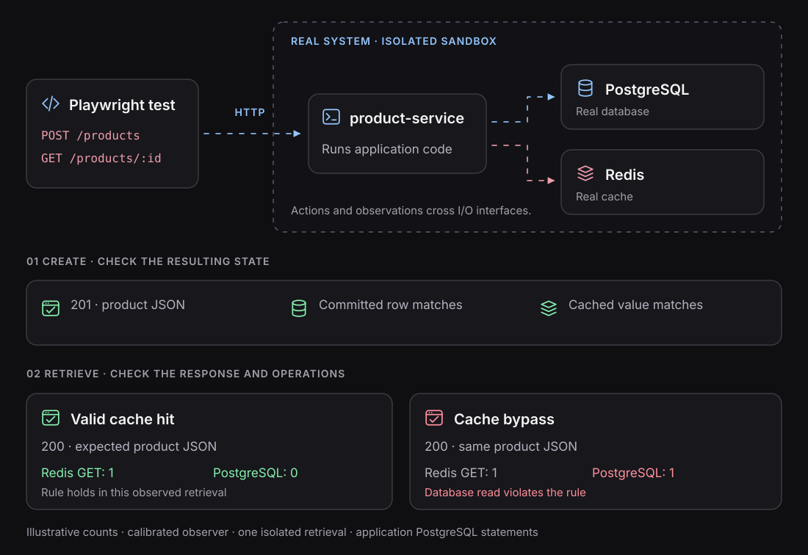
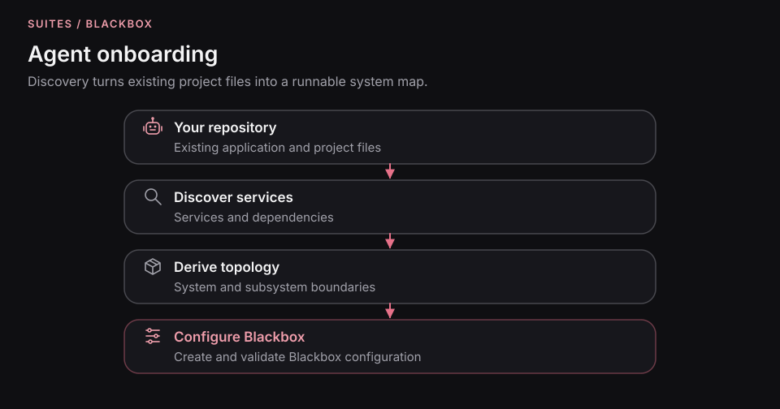
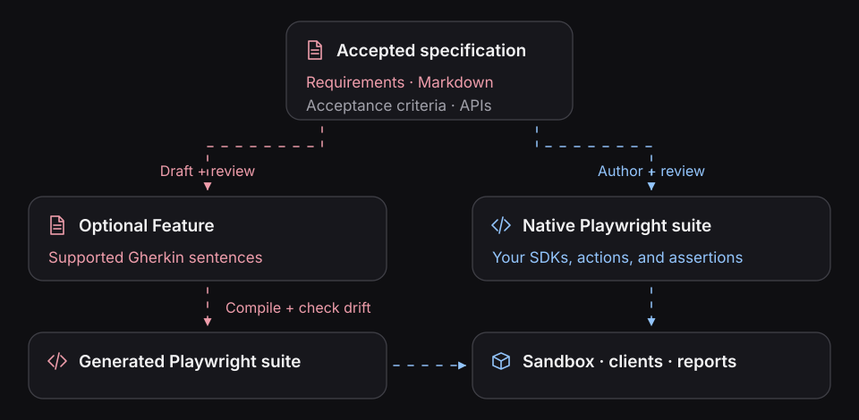
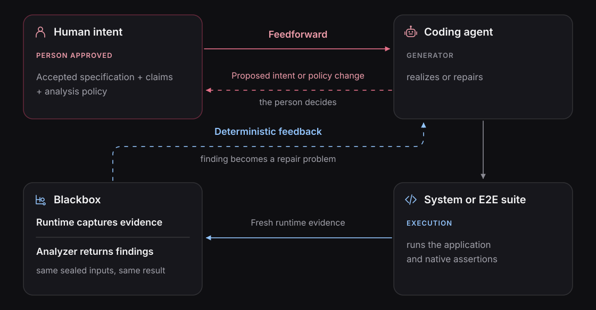

<p align="center">
  
</p>

<h1 align="center">Suites / Blackbox</h1>

**Spec-Driven Verification for agentic software engineering.**

Blackbox helps **people building with coding agents** check whether a running application does what its specification says. It gives the agent a way to start the real system in isolation, run executable tests, and inspect what happened—not just whether a test process turned green.

**The spec says what should happen. Blackbox helps check what actually happened.**

[Get started](#give-your-agent-a-spec) · [Worked example](docs/guides/verify-a-specification.md) · [Documentation](docs/README.md)

## When a green response isn't enough

Suppose your specification says:

> Creating a product stores it in PostgreSQL and Redis. When that product is cached, retrieving it must **not read PostgreSQL**.

The API can return the right product while still reading the database unnecessarily. So we check the **response**, the **saved values**, and what the application **did during retrieval**.

<p align="center">
  
</p>

That's what *behavioral verification* means here. A **claim** is simply something the spec says must be true. **Evidence** is what we actually observed to check it.

[How to choose evidence](docs/concepts/behavioral-evidence.md)

## Give your agent a spec

Blackbox comes with a **CLI and agent skills** for discovering the application's services, choosing what needs to run, configuring the test environment, and investigating failures.

Copy this task into your coding agent:

```text
Set up Blackbox to verify the accepted spec in this repository.
Discover the services needed for this behavior and prepare an isolated
system. Write the tests for my review, then run one focused check.
Show me the HTML report, what passed, what failed, and anything
the test couldn't observe. Don't change the spec to fit the code.
```

The planned quick setup command is `npx @suites/blackbox-cli onboarding start`; **it is not yet shipped**. In a prepared source checkout, the existing skills workflow starts with:

```sh
pnpm exec blackbox skills list
pnpm exec blackbox skills install blackbox --codex
pnpm exec blackbox skills install discovery --codex
```

Use the [onboarding guide](docs/playwright/connect-your-application.md) for other agents, package prerequisites, and configuration.

<p align="center">
  
</p>

## From specification to executable tests

The original spec can live in Markdown, a ticket, an API contract, or an SDD workflow such as [Spec Kit](docs/integrations/spec-kit.md). **You keep ownership of the expected behavior.** The agent proposes concrete tests; you review them before using them to judge an implementation.

<p align="center">
  
</p>

**Option A — a Feature file.** Write the behavior in readable Gherkin and generate native Playwright. This short excerpt checks the creation response; the [full Feature](docs/features/drafting-feature-files.md) also checks PostgreSQL, Redis, and cache-only retrieval.

```gherkin
@system:product-system @sandbox:default
Feature: Product creation and retrieval
  Rule: Persist products and serve valid cache entries
    Scenario: Create a product
      When client "api" sends POST "/products" with JSON:
        """json
        { "id": "product-1", "name": "Field notebook", "priceCents": 1299 }
        """
      Then the response status is 201
```

**Option B — native Playwright.** Write TypeScript using your application's SDK clients and ordinary assertions. Both authoring paths get an independent Sandbox for each physical test attempt.

```ts
import { expect, test } from '@suites/blackbox-playwright';
import { api } from './clients.js';

test.system('product-system', (system) => {
  system.sandbox('default', { clients: { api } }, (suite) => {
    // One fresh, isolated Sandbox per test attempt.
    suite.test('creates and stores a product', async ({ clients }) => {
      const product = { id: 'product-1', name: 'Field notebook', priceCents: 1299 };
      const response = await clients.api.post('/products', { data: product });
      expect(response.status()).toBe(201);
      expect(await response.json()).toMatchObject(product);
      const state = await clients.api.get('/fixture/products/product-1');
      expect(await state.json()).toEqual({ postgres: product, redis: product });
    });
  });
});
```

The `/fixture/` route belongs to the **example application**, not Blackbox. The [complete native suite](docs/playwright/README.md) includes the separate cached-retrieval test.

## Run it. Inspect it. Repair it.

Blackbox's Sandbox starts the selected real application and its dependencies, readies clients, and releases them afterward. **Playwright runs the checks and creates the HTML report.**

In the **product-cache sample**, after the pending Feature compiler and example are available, the Feature path is:

```sh
# Run from e2e/product-cache/
pnpm exec blackbox feature file validate tests/product-cache.feature \
  --clients tests/clients.ts
pnpm exec blackbox feature suite validate tests/product-cache.feature \
  --clients tests/clients.ts --output tests/product-cache.generated.spec.ts
pnpm --dir .. exec playwright test --config product-cache/playwright.config.ts --project feature
pnpm --dir .. exec playwright show-report product-cache/playwright-report
```

For handwritten tests, select `--project native` instead. [Installation and runnable prerequisites](docs/guides/verify-a-specification.md#run-the-supplied-example) · [Feature generation](docs/features/generating-test-suites.md)

A result is useful when it tells the agent **what differed from the spec**. In the deliberate cache-bypass exercise, the response still passes, but the database-read check fails. The agent repairs the code and reruns the **same expected behavior**.

<p align="center">
  
</p>

[Follow the repair](docs/guides/repair-from-evidence.md) · [Investigate interactively with Capsules](packages/capsule/README.md)

## Keep the spec connected as code changes

There are three different questions:

| Question | How we answer it |
| --- | --- |
| Did the test capture what we actually meant? | **Review** the test against the spec |
| Does generated TypeScript still match its Feature? | **Check for drift** in the generated suite |
| Does the running implementation behave as required? | **Run the test** and examine its results |

A passing test establishes the assertions that actually ran—not that every requirement has been checked. Runtime observations, including OpenTelemetry, can help answer harder questions; they are **one evidence source**, not a requirement for every test.

[Spec-Driven Verification](docs/concepts/spec-driven-verification.md) · [Evidence and limits](docs/concepts/behavioral-evidence.md) · [CI and suite drift](docs/features/generating-test-suites.md)

---

**Candidate alpha:** the Feature compiler and typed Playwright clients depend on [PR #181](https://github.com/suites-dev/blackbox/pull/181). The `e2e/product-cache/` sample is not yet on this documentation branch. The workflows above are documented for the candidate implementation; don't treat them as a runnable release until those dependencies land.

[All docs](docs/README.md) · [Contributing](CONTRIBUTING.md) · [License](LICENSE)
