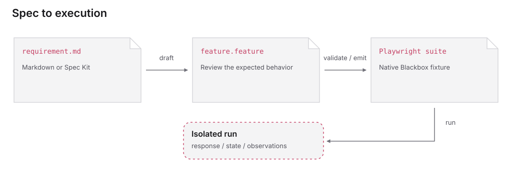
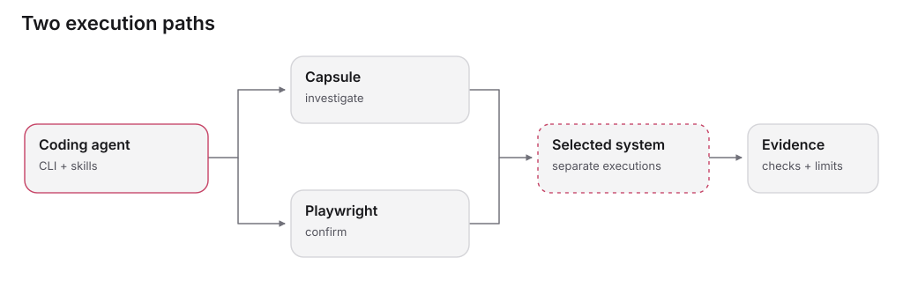
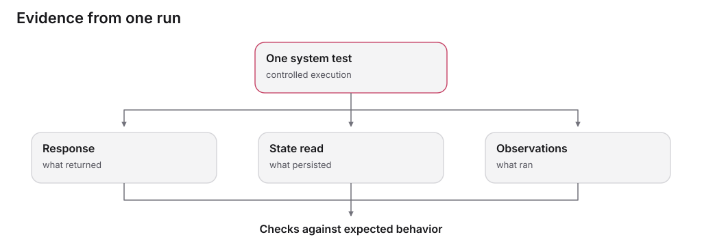
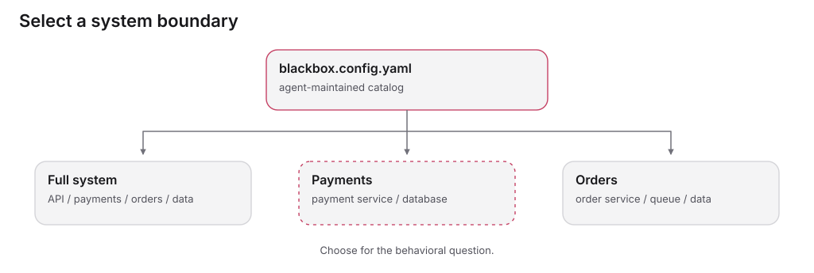

# Suites Blackbox

**Executable specs for agentic software engineering.**

Blackbox is a verification framework for people building software with coding agents. Its CLI and agent skills connect accepted behavior to executable system tests and evidence from the running application.

The framework provides isolated environments, system discovery, runtime observation, and Playwright integration so your agent can investigate changes and check them against the specification. Start with ordinary Markdown, native tests, or an existing SDD workflow such as Spec Kit.

[Documentation](docs/README.md) · [Getting started](docs/getting-started/index.md) · [Examples](docs/examples/README.md)

## System behavior

A system can return the right response and still leave the wrong state or make an unwanted downstream call. Blackbox gives your agent access to those different evidence sources: **what came back, what was saved, and which supported operations were observed**.

Use system-level checks for that behavior. Use unit tests for an isolated calculation. An internal refactor can still need system verification; the question is what must remain true, not which file changed.

[Behavioral evidence](docs/verification/behavioral-evidence.md)

## Agent setup

Copy this task into your coding agent from the project directory:

```txt
Set up Suites Blackbox for this repository using its CLI and skills.
Start with npx @suites/blackbox-cli onboarding start when available;
otherwise follow the documented source-preview setup.
Discover the smallest useful system, run a focused check, and show
me the HTML report. Use my requirements as the expected behavior.
Ask before changing them.
```

The agent handles packages, Discovery, the catalog, drivers, and supported instrumentation. You review the scope and expected behavior.

**Preview:** the onboarding, spec-draft, validate, and suite-emit commands below describe the target interface. [Availability and command map](docs/status.md) gives the implemented source-preview equivalents and incoming PRs.

```console
$ blackbox onboarding start
```

[Onboarding](docs/getting-started/agent-onboarding.md) · [Source installation](docs/getting-started/installation.md) · [Agent skills](docs/agents/skills.md)

## From specification to executable checks

An SDD workflow can own the specification without owning the test runtime. Vanilla Blackbox starts from your Markdown; the optional **blackbox-spec-kit** bridge starts from the active Spec Kit feature. Both feed the same reviewed Feature and execution path.

<picture>
  <source media="(max-width: 600px) and (prefers-color-scheme: dark)" srcset="docs/assets/figures/readme-spec-workflow-mobile-dark.svg">
  <source media="(max-width: 600px)" srcset="docs/assets/figures/readme-spec-workflow-mobile-light.svg">
  <source media="(prefers-color-scheme: dark)" srcset="docs/assets/figures/readme-spec-workflow-dark.svg">
  
</picture>

### 1. Draft from the requirement

`requirement.md`:

```markdown
## REQ-101: Create a subscription
Given an eligible customer and an empty subscription store,
the request returns 201 and creates one subscription.
```

```console
$ blackbox spec draft --file requirement.md
```

### 2. Review and validate the Feature

`feature.feature` below uses the preview vocabulary. The selected fixture seeds Alice and configures the named state-reader credential.

```gherkin
@system:subscription-system @sandbox:default
@requirement:REQ-101
Feature: Subscriptions
  Scenario: Alice subscribes
    When the client sends POST "/subscriptions" with JSON:
      """json
      {"userId":"alice","paymentMethodId":"pm_alice_primary"}
      """
    Then the response status is 201
    And the state at "/fixture/state" as "fixture-control" has 1 item at "/subscriptions"
```

Review the expectations against the requirement, then validate and emit:

```console
$ blackbox feature validate --file feature.feature
$ blackbox feature suite emit --file feature.feature
```

Validation checks the supported language and configuration; it does not establish that the application satisfies the Feature.

### 3. Run the Playwright suite

The compiler targets the same Sandbox API available to directly authored tests. This abbreviated native equivalent shows the execution boundary, not literal compiler output:

```ts
import { expect, test } from '@suites/blackbox-playwright';
import { fixtureEnvironment, readFixtureState } from './support.js';

test.system('subscription-system', (system) => {
  // Each test attempt runs in its own isolated Sandbox.
  system.sandbox('default', { environment: fixtureEnvironment() }, (suite) => {
    suite.test('Alice subscribes', async ({ request, sandbox }) => {
      const response = await request.post(
        new URL('/subscriptions', sandbox.entrypoint.url).href,
        { data: { userId: 'alice', paymentMethodId: 'pm_alice_primary' } },
      );
      expect(response.status()).toBe(201);
      const state = await readFixtureState(request, sandbox.entrypoint.url);
      expect(state.subscriptions).toHaveLength(1);
    });
  });
});
```

`support.js` is project-owned fixture code, not a Blackbox API. The [complete example](docs/examples/README.md) includes initial-state checks, helpers, and configuration. Generated suites are derived, git-ignored output; edit the Feature, not the generated test.

```console
$ npx playwright test --grep "Alice subscribes"
$ npx playwright show-report
```

The result checks the selected behavior under the recorded conditions. It is not a proof of every statement in the source specification.

[Feature workflow](docs/specifications/index.md) · [Native Playwright](docs/playwright/index.md) · [Spec Kit integration](docs/integrations/spec-kit.md)

## Experiments and repeatable tests

Use a **Capsule** to investigate: establish state, act on the system, inspect evidence, repair, and repeat. Use **Playwright** to preserve accepted behavior as a repeatable check. These are separate executions of a selected system, not a shared live environment.

<picture>
  <source media="(max-width: 600px) and (prefers-color-scheme: dark)" srcset="docs/assets/figures/readme-machine-mobile-dark.svg">
  <source media="(max-width: 600px)" srcset="docs/assets/figures/readme-machine-mobile-light.svg">
  <source media="(prefers-color-scheme: dark)" srcset="docs/assets/figures/readme-machine-dark.svg">
  
</picture>

**Observed behavior is not automatically accepted behavior.** An experiment can suggest a test, but its expectation comes from the requirement and review. Already have the relevant test? Run it directly.

[Capsule experiments](docs/capsules/experiments.md) · [Recording verification](docs/agents/authoring-verification.md)

## Verification and evidence

Verification compares expected behavior with evidence. Ordinary response and state assertions remain essential; supported runtime observations add another view of the same execution.

<picture>
  <source media="(max-width: 600px) and (prefers-color-scheme: dark)" srcset="docs/assets/figures/readme-evidence-mobile-dark.svg">
  <source media="(max-width: 600px)" srcset="docs/assets/figures/readme-evidence-mobile-light.svg">
  <source media="(prefers-color-scheme: dark)" srcset="docs/assets/figures/readme-evidence-dark.svg">
  
</picture>

A database call does not prove a committed row. A message send does not prove consumer completion. Missing telemetry is a limitation, not proof that an operation did not happen. Effects describe supported observations; they are not a substitute for all the evidence a claim needs.

[Evidence sources](docs/verification/evidence.md) · [Completion and causality](docs/verification/limitations-and-causality.md)

## System boundaries and CI

Run the smallest system that can answer the question. Keep the participants and dependencies the behavior needs; make substitutions and external services explicit.

<picture>
  <source media="(max-width: 600px) and (prefers-color-scheme: dark)" srcset="docs/assets/figures/readme-boundaries-mobile-dark.svg">
  <source media="(max-width: 600px)" srcset="docs/assets/figures/readme-boundaries-mobile-light.svg">
  <source media="(prefers-color-scheme: dark)" srcset="docs/assets/figures/readme-boundaries-dark.svg">
  
</picture>

Run selected tests and Capsule experiments during development; run the broader suite in CI. Each physical Playwright attempt, including a retry, gets a fresh Sandbox. Isolation enables concurrency, but memory, CPU, Docker capacity, and shared external dependencies limit the worker count.

The incoming Gherkin verification path checks more than the test exit code:

```console
$ blackbox feature compile --config blackbox.feature.yaml
$ npx playwright test
$ blackbox feature verify --config blackbox.feature.yaml
```

The verifier checks the completed run against the compile manifest and protected policy: generated-file consistency, scenario execution, and runner settings. Source-specification-to-Feature alignment is a separate review; hashes cannot establish semantic completeness. The packaged CI Action is planned; the CLI remains the underlying interface.

In automation, preserve failures from both Playwright and the verifier. Use the [CI procedure](docs/playwright/ci.md), not a shell sequence whose last successful command hides an earlier failure.

[System boundaries](docs/systems/system-boundaries.md) · [Feature/suite drift](docs/specifications/drift.md) · [Execution and retries](docs/playwright/execution-and-retries.md)

## Reports

The agent reads structured results; you can inspect the same execution in the reports. Playwright retains native terminal and HTML reporting with Blackbox lifecycle, identity, and evidence attachments. Capsules have a separate retained HTML report.

A retained Capsule HTML report is available in the artifacts of [CI run 37491624257](https://github.com/suites-dev/blackbox/actions/runs/37491624257). The [capture record](docs/assets/screenshots/README.md) identifies the source, reproduction steps, and outstanding screenshots. Report captures are not simulated test results.

[Playwright reports](docs/playwright/reports.md) · [Capsule reports](docs/capsules/reports.md)

## Documentation and integrations

[Agent skills](docs/agents/skills.md) · [Discovery and catalog](docs/systems/index.md) · [Configuration](docs/systems/blackbox-config.md) · [Drivers](docs/systems/drivers.md) · [Node instrumentation](docs/systems/instrumentation.md) · [CLI reference](docs/reference/cli/index.md)

Spec Kit is optional. The [blackbox-spec-kit guide](docs/integrations/spec-kit.md) describes the accepted-specification handoff; [ordinary Markdown](docs/specifications/from-markdown.md) and directly authored Playwright tests remain first-class paths.

[Contributing](CONTRIBUTING.md) · [Security](SECURITY.md) · [License](LICENSE)
