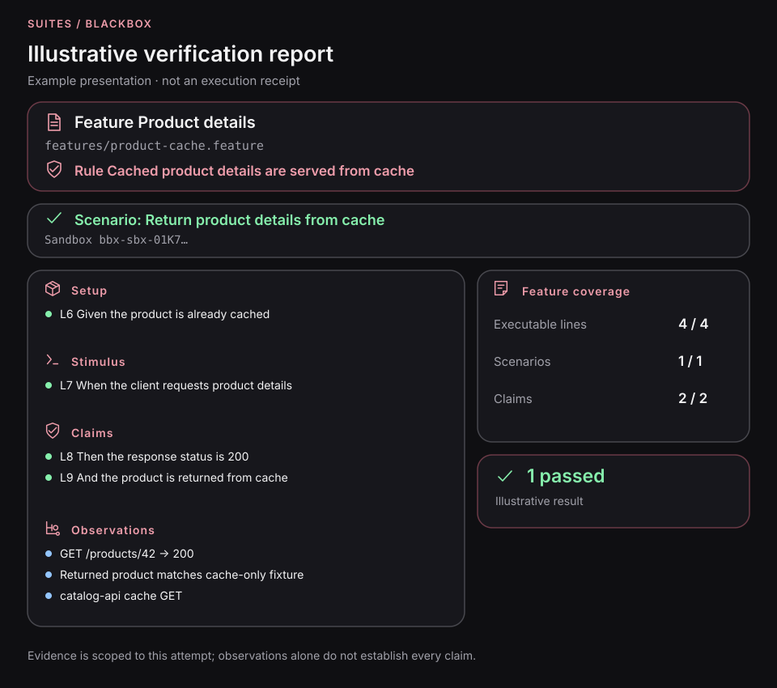

<p align="center">
  
</p>

<h1 align="center">Suites / Blackbox</h1>

**A system testing framework for executable specifications and runtime verification, built for developers and coding
agents.**

Blackbox turns accepted specifications into repeatable verification against real applications and subsystems. Coding
agents can execute the specified behavior, inspect what happened, investigate failures, repair the implementation, and
rerun against the same accepted expectations.

Expected behavior can be expressed directly in native Playwright tests or through optional executable Feature files
that generate a native suite. Each test attempt runs in a fresh isolated Sandbox, using response, state, and runtime
evidence to evaluate the specified claims.

## Spec-Driven Verification

Spec-Driven Verification checks a running system against an accepted specification. That specification can come from
product requirements, acceptance criteria, an API contract (like Swagger and OpenAPI), a Markdown document, or any 
other source of agreed behavior.

**Accepted behavior defines the checks; each execution supplies evidence.**

Developers and coding agents turn those requirements into executable expectations for review. They can write native
Playwright tests directly or generate suites from optional Feature files. Blackbox runs the selected application or
subsystem and gathers evidence for the specified claims.

The example below follows the optional Feature-file workflow, from a Markdown specification through review and suite
generation to runtime verification:

<p align="center">
  
</p>

Specifications in any format can become stale as implementation evolves. Blackbox keeps their accepted expectations
in the verification loop: review checks that executable expectations preserve the intended behavior, and repeated
execution makes departures from that behavior visible.

This also fits spec-driven development (SDD) workflows such as Spec Kit, Kiro and Openspec. SDD guides 
specification, clarification, planning, and implementation; Blackbox provides executable verification of the accepted
system behavior.

[Spec-Driven workflows integration](docs/integrations/spec-driven-workflows.md)


## Installation - let your coding agent run Blackbox

Ask your coding agent to set up Blackbox in your repository, starting with:

```bash
$ npx @suites/blackbox-cli onboarding start
```

Blackbox provides a full skill system out of the box to let coding agents handle the operational work, from initial
setup to execution, investigation, and verification. The skills provide the procedures and context, while Blackbox’s CLI
returns structured feedback the agent can act on.

### Agent Onboarding

During onboarding, the agent inspects the repository, discovers services and dependencies, and derives the system
topology. It identifies useful application and subsystem boundaries, then creates or updates the Blackbox configuration
and supporting files.

<p align="center">
  
  <br />
  <sub>The agent derives runnable boundaries from the repository’s services and dependencies.</sub>
</p>

The result describes what to run, how to start it, and how to act on and observe it. The agent reuses existing project
files where appropriate. For a Node application with an HTTP service, the setup could look like this:

<p align="center">
  
  <br />
  <sub>Configuration references the files that start, drive, and observe the system.</sub>
</p>

`blackbox.config.yaml` is the configuration authority and references the supporting files. Capsules and Playwright use
that configuration to run the selected system and collect evidence.

[Initial setup](docs/getting-started/agent-onboarding.md) ·
[Agent skills](docs/agents/skills.md)

## Behavior-driven verification

[Behavior-driven development (BDD)](https://cucumber.io/docs/bdd/) uses concrete examples to establish a shared
understanding of expected behavior. Blackbox adopts that approach to verifying real applications and subsystems:
scenarios establish initial conditions, perform an action, and check the required outcomes.

**These specifications describe what the running system must do:** its responses, state changes, and required runtime
effects, such as serving a product from cache. Their meaning should remain stable when classes, functions, or code
organization change while the required behavior stays the same. Native Playwright tests can express these expectations
directly.

### Express scenarios with executable Feature files

For this optional workflow, Blackbox adopts [Gherkin from Cucumber](https://cucumber.io/docs/gherkin/reference/).
A `Feature` describes a capability, a `Rule` groups scenarios illustrating a business rule, and each `Scenario` states
initial conditions (`Given`), an action (`When`), and expected outcomes (`Then`).

The agent drafts or refines the specification into Blackbox’s closed executable vocabulary for review. Supported steps
have defined setup, action, and verification semantics, without a separate
regex step-definition layer. Existing Gherkin may need refinement to use that vocabulary.

The following example connects the source specification, reviewed Feature, and native Playwright suite around the same
response and required cache behavior:

<p align="center">
  
</p>

<details>
<summary>View the specification and tests</summary>

**Specification · `product-cache.md`**

```markdown
# Product details

## Business rule

Cached product details are served from cache.

## Acceptance example

A product is already cached. When a client requests its details:

- The response status is 200.
- The product is returned from cache.
```

**Feature · `features/product-cache.feature`**

The reviewed Feature expresses the same business rule and acceptance example:

```gherkin
Feature: Product details

  Rule: Cached product details are served from cache

    Scenario: Return product details from cache
      Given the product is already cached
      When the client requests product details
      Then the response status is 200
      And the product is returned from cache
```

**Native suite · `product-cache.spec.ts`**

Generation preserves the `Feature → Rule → Scenario → steps` nesting and names. Within each scenario, `Given` arranges
the initial state, `When` applies the stimulus, and `Then` asserts the expected outcomes, following Arrange–Act–Assert
(AAA). `And` continues the preceding step type. The selected system and its isolated Sandbox provide the execution
context around that hierarchy.

The planned native expression below retains the same capability, business rule, scenario, and steps. The existing
[Playwright E2E suite](https://github.com/suites-dev/blackbox/blob/8017b623d5c5da5f162f3ee828a703cb814ea1cf/e2e/tests/playwright/subscription-system.spec.ts)
illustrates the underlying system-test structure. This example requires a cache-only fixture: product 42 is present in
the cache and absent from the backing store, so its returned value can establish the response source.

```ts
import { randomUUID } from 'node:crypto';
import { expect, test } from '@suites/blackbox-playwright';

test
.system('products-system')
.feature('Product details')
.run(({ sandbox }) => {
  sandbox.describe('Rule: Cached product details are served from cache', ({ suite }) => {
    suite.test(
      'Scenario: Return product details from cache',
      async ({ activities, request, sandbox, effects }) => {
        const product = { id: '42', name: `Cached product ${randomUUID()}` };
        const url = (path: string) => new URL(path, sandbox.entrypoint.url).href;

        await test.step('Given the product is already cached', () =>
          activities.setup.request('seed cache-only product', request, async (scoped) => {
            const seeded = await scoped.post(url('/__fixtures/products/cache-only'), {
              data: product,
            });
            expect(seeded.status()).toBe(204);
          }));

        const response = await test.step('When the client requests product details', () =>
          activities.stimulus.request('request product details', request, (scoped) =>
            scoped.get(url('/products/42')),
          ));

        await test.step('Then the response status is 200', async () => {
          expect(response.status()).toBe(200);
        });

        await test.step('And the product is returned from cache', async () => {
          expect(await response.json()).toEqual(product);

          await expect(effects).toSatisfy((e) => [
            e.exists(e.cache({ actor: 'catalog-api', operation: 'GET' })),
          ]);
        });
      },
    );
  });
});
```

**Draft, review, generate, and run**

The agent drafts the Feature from the specification for review. Once its expectations are accepted, it validates the
Feature, generates the native suite, and runs it against the selected application or subsystem:

```console
$ blackbox spec feature draft --file product-cache.md
$ blackbox feature validate --file features/product-cache.feature
$ blackbox feature suite emit --file features/product-cache.feature
$ npx playwright test
```

</details>

The project-owned fixture endpoint seeds the cache and removes any backing-store copy of the product. Setup remains
separate from the stimulus. The final claim combines that controlled initial state, the returned product, and cache-read
evidence from the same execution; observing a cache read alone would not establish that the product was served from it.

**Keep specifications connected as the system evolves.** Review checks that executable expectations remain faithful to
the accepted specification. Repeated execution checks those expectations against the running system. When intended
behavior changes, revise the specification and its executable expectations together.

For the Feature workflow, `blackbox feature suite check` also detects deterministic drift between the accepted Feature
and its generated suite. After reviewing changes to the Feature, regenerate the suite and verify the new expectations.
Review maintains meaning, generation keeps the derived suite aligned, and execution supplies evidence for the exercised
claims.

[Executable specifications](docs/specifications/index.md) ·
[Feature files](docs/specifications/feature-files.md)

## Developer-agent verification loop

The developer approves the specification, behavioral claims, and verification policy. The coding agent uses that
guidance to implement the behavior, prepare system tests, and investigate failures.

<p align="center">
  
</p>

Blackbox turns fresh runtime evidence into findings the agent can inspect and act on. The agent repairs the
implementation and reruns verification against the same accepted expectations. Proposed changes to the specification
or verification policy return to the developer for review.

## Inspect the result and its evidence

Playwright remains the test runner. Blackbox adds execution context and evidence to its terminal and HTML reports.
For the cache scenario, a report can look like this:

<p align="center">
  
  <br />
  <sub>Claims and coverage appear alongside evidence from the same attempt.</sub>
</p>

Claims are supported, refuted, or unresolved according to the available response, state, and runtime evidence. In this
example, the response establishes the status code. The cache claim combines the controlled initial state, returned
product, and runtime evidence from the same execution.

Different claims require different evidence. Observing a database operation does not establish that a transaction
committed. Observing a message being published does not establish that a consumer completed its work. An operation that
was not observed is not automatically evidence that it never happened.

Blackbox keeps those limits explicit so a passing verification does not claim more than the execution established.

For suites generated from Feature files, **Executable Feature Coverage** shows which executable Feature lines and
Examples rows were actually exercised by the run. It measures coverage of the executable Feature; an exercised line
still needs evidence to support its claim.

The HTML report connects scenarios, Sandbox execution, claims, observations, and retained evidence, including the
associated Feature when present:

```console
$ npx playwright show-report
```

[Reports](docs/playwright/reports.md) ·
[Verification](docs/verification/index.md) ·
[Evidence](docs/verification/evidence.md) ·
[Evidence qualification](docs/verification/evidence-qualification.md)

## Investigate with Capsules

When a claim is refuted or unresolved, the agent can use a Capsule to investigate. Capsules also support experiments
with candidate expectations before they become accepted behavior.

| Mode                   | Purpose                                                                      |
|------------------------|------------------------------------------------------------------------------|
| Playwright system test | Repeat accepted expectations against a fresh isolated Sandbox.               |
| Capsule                | Act on a running system, inspect evidence, test a hypothesis, and try again. |

A Capsule is a bounded interactive experiment. The agent can inspect what happened, change the implementation, and
repeat the experiment. When the investigation suggests a new expectation, it goes through review before becoming part
of the accepted specification. The example below carries that expectation into an accepted Feature and its Playwright
suite:

<p align="center">
  
  <br />
  <sub>Candidate expectations require review before joining the accepted specification.</sub>
</p>

**Observed behavior is not automatically accepted behavior.** A Capsule can validate or challenge a candidate
expectation; the accepted specification remains the source of what the implementation must satisfy.

Stopping the environment does not discard the experiment. Its activities, observations, and evidence remain available
for inspection and reporting.

[Capsules](docs/capsules/index.md) ·
[Experiments](docs/capsules/experiments.md) ·
[Capsule reports](docs/capsules/reports.md) ·
[Playwright verification](docs/playwright/index.md)

---

## Run the system your claim requires

Blackbox can run a full application or a smaller subsystem. Use the smallest real system boundary that can answer the
claim being checked, including every participant needed to establish the behavior.

A focused boundary lowers startup cost, memory use, and unrelated runtime noise. It also reduces the number of competing
explanations when an execution fails. A cross-service workflow still needs the participants required to establish that
workflow.

The agent configures these boundaries during discovery. Configuration selects the system, drivers provide controlled
ways to act on it and inspect state, and instrumentation provides supported runtime observations:

<p align="center">
  
  <br />
  <sub>Capsules and Playwright share the configured boundary, drivers, and instrumentation.</sub>
</p>

Use unit tests for the behavior of a function or class. Use Blackbox when the claim concerns a running application or
subsystem, including when an internal implementation change could affect that behavior.

[System boundaries](docs/systems/system-boundaries.md) ·
[Configuration](docs/systems/blackbox-config.md) ·
[Systems](docs/systems/index.md) ·
[Drivers](docs/systems/drivers.md) ·
[Instrumentation](docs/systems/instrumentation.md)

---

## Keep verification consistent locally and in CI

Local iteration and CI use the same accepted expectations. An agent can focus on selected scenarios and Capsule
experiments during development, while CI runs the suite selected by the repository's verification policy.

Every physical Playwright attempt gets a fresh Sandbox. Isolation enables parallel execution; CPU, memory, and container
resources determine how much concurrency is practical.

For repositories using the Feature workflow, three checks protect different parts of verification:

| Check                                              | What it establishes                                                                              |
|----------------------------------------------------|--------------------------------------------------------------------------------------------------|
| `blackbox feature suite check`                     | The generated suite matches the accepted Feature and current compiler inputs.                    |
| `blackbox feature verify`                          | Required scenarios ran, verdicts are supported, and runner policy matches the accepted baseline. |
| `blackbox feature change check --base origin/main` | Changes to accepted Features satisfy the repository's specification-change policy.               |

For generated Feature suites, CI checks that the suite is current, runs it, and verifies the completed execution:

```console
$ blackbox feature suite check
$ npx playwright test
$ blackbox feature verify
```

The generated suite is derived from the accepted Feature. Source-specification-to-Feature alignment is a separate
semantic question from deterministic Feature-to-suite drift. Repositories that protect specifications separately from
implementation changes can also use `feature change check` against their chosen base branch.

[CI verification](docs/playwright/ci.md) ·
[Specification drift](docs/specifications/drift.md)

---

## Alpha and next steps

Blackbox is under active development. The executable Feature workflow described here is upcoming. APIs, command names,
and report formats may change before the stable release.

Start with [coding-agent onboarding](#let-your-coding-agent-run-blackbox), or explore the guides below.

[Getting started](docs/getting-started/index.md) ·
[Initial setup](docs/getting-started/agent-onboarding.md) ·
[CLI reference](docs/reference/cli/index.md)
