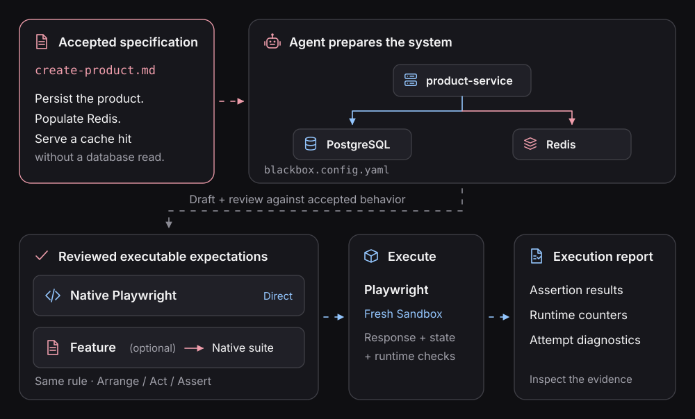

# Blackbox documentation

**Spec-Driven Verification:** start with an accepted requirement, run your actual system, and check
whether it behaved as expected.

  

The running example is simple to state but easy to implement incorrectly: **creating a product must
persist it and cache it; retrieving a valid cached value must not read PostgreSQL**.

## Choose where to begin

| I want to…                            | Read                                                                     |
| ------------------------------------- | ------------------------------------------------------------------------ |
| Follow the whole example              | [Verify a specification](guides/verify-a-specification.md)               |
| Connect my own app with an agent      | [Get started with my repository](playwright/connect-your-application.md) |
| Write TypeScript tests                | [Native Playwright](playwright/README.md)                                |
| Write a reviewed Gherkin Feature      | [Feature files](features/README.md)                                      |
| Diagnose a real behavioral difference | [Repair from evidence](guides/repair-from-evidence.md)                   |

## Why this matters when agents write the code

[Read the motivation](concepts/why-verification-now.md): faster implementation makes accepted specs,
constrained executable checks, and evidence more important. **A test must judge the running
behavior, not just the code the agent produced.**

## Understand what Blackbox checks

  

[Spec-Driven Verification](concepts/spec-driven-verification.md) explains why the spec remains the
source of expected behavior. [Evidence](concepts/behavioral-evidence.md) explains why some
expectations need a response, others need a database read, and still others need to observe
downstream activity.

## Investigate and confirm

[Capsule experiments](guides/investigate-with-capsule.md) let an agent narrow an unfamiliar failure;
[Playwright](playwright/README.md) preserves reviewed expectations as repeatable checks. Both run
against a selected real system, but they are separate attempts.

## Go deeper only when you need it

[HTTP](guides/testing-http-apis.md) · [PostgreSQL](guides/testing-postgres.md) ·
[Redis](guides/testing-redis.md) · [Async completion](guides/testing-async-flows.md) ·
[Clients and fixtures](playwright/clients-and-fixtures.md) · [Feature syntax](features/reference.md)
· [Spec Kit integration](integrations/spec-kit.md)

The example's protected `/fixture/` endpoints are application-owned, not automatic Blackbox APIs.
[Capsules](../packages/capsule/README.md) support interactive investigation.

**Candidate alpha:** these walkthroughs refer to the pending
[Feature/Playwright implementation](https://github.com/suites-dev/blackbox/pull/181) and
`e2e/product-cache/` sample. Check
[prerequisites](guides/verify-a-specification.md#run-the-supplied-example) before running their
commands.
