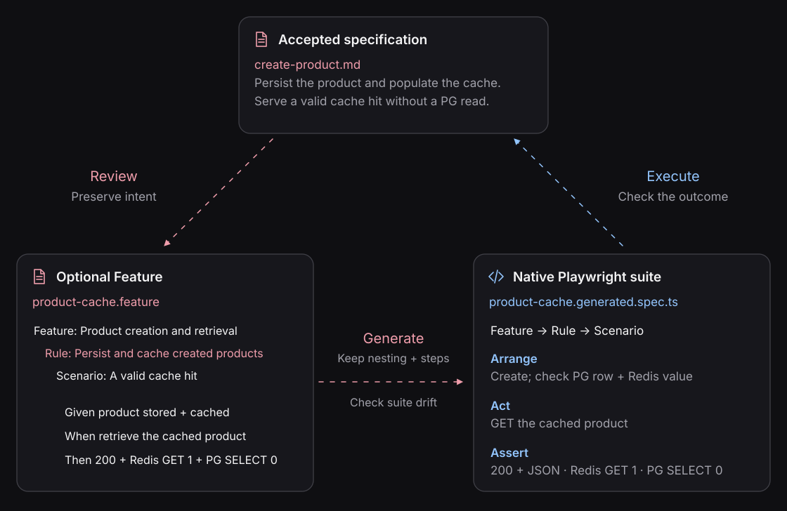
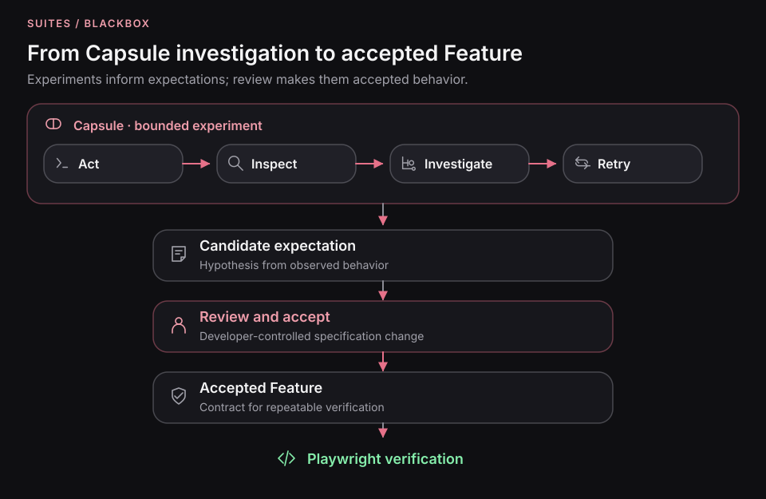

# Review the behavior, then execute it

A Feature is a **reviewable expression of executable expectations derived
from accepted behavior**. In the product example, creation must persist
in PostgreSQL and populate Redis; cache-hit retrieval must avoid PostgreSQL.
Its scenarios should make those distinct claims explicit.

As SDD makes specifications central, Gherkin gives developers and agents
a shared surface to review concrete behavior. But **the original
specification remains authoritative**, and an emitted test does not
automatically prove that every requirement was represented.

Blackbox parses Gherkin with Cucumber and compiles supported sentences
into native Playwright. Features are optional; the same accepted claims
can be verified with [native Playwright](../playwright/README.md).

  

Begin with [the product verification walkthrough](../guides/verify-a-specification.md).
At scenario review, follow [the Feature authoring path](drafting-feature-files.md),
then return to its shared evidence and [implementation repair](../guides/repair-from-evidence.md).
The application, rule, and evidence stay the same whichever authoring path you use.

## A Feature bridges intent and execution

The accepted specification states *what software must do*. A Feature selects
concrete executable examples of that intent. The compiler checks supported
language and emits a suite; it cannot certify semantic completeness of the
original human requirements.

An existing SDD workflow may own the specification independently of
Blackbox. See [Spec Kit integration](../integrations/spec-kit.md) and the
[verification model](../concepts/spec-driven-verification.md).

## Keep the specification connected to the system

Three checks maintain different relationships:

| Check                                                       | What it establishes                                                        |
| ----------------------------------------------------------- | -------------------------------------------------------------------------- |
| Review the scenarios against the accepted specification     | The executable expectations preserve the intended behavior.                |
| Generate and [check suite drift](generating-test-suites.md) | The generated file still matches the reviewed Feature and compiler inputs. |
| Run the suite and inspect the evidence                      | This execution satisfied or violated those assertions.                     |

Repeated execution exposes departures from accepted behavior as implementation
evolves. Review still matters: a passing suite cannot establish that an arbitrary
prose specification is complete or that every clause was represented.

The current compiler has a [defined HTTP vocabulary](reference.md#sentence-reference).
The product example uses protected, project-owned HTTP endpoints to inspect
PostgreSQL and Redis. Use native tests when your observations need direct SDK calls
or other operations outside that vocabulary.

## Bring findings back to review

A [Capsule experiment](../../packages/capsule/skills/capsule/references/capsule-experiments.md)
can investigate a failure or explore a candidate expectation before it becomes
part of the specification. Observed behavior does not become accepted behavior
automatically: review the finding against the intended outcome, then express any
accepted change in the Feature or native suite.

  

The figure follows the optional Feature path. Native tests can carry the same
reviewed expectation into repeatable verification.

[Author the product Feature](drafting-feature-files.md) ·
[Maintain the generated suite](generating-test-suites.md) ·
[Language and compiler reference](reference.md)
