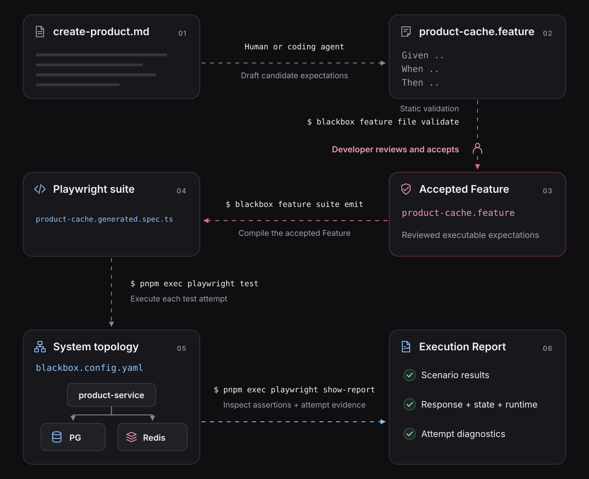

# Express the product rule as a Feature

Start with the **accepted product specification**, not arbitrary test steps.
Creation must persist in PostgreSQL and Redis, and valid-cache retrieval
must avoid PostgreSQL. This page turns those claims into reviewed Gherkin
scenarios and generates a native Playwright suite.

The `Feature → Rule → Scenario` hierarchy gives SDD teams a shared way to
review concrete behaviors. It **does not replace the source specification
or guarantee every requirement was captured**. Native Playwright is
another first-class executable authoring path.

<p align="center">
  
</p>

Complete [the sample preparation](../guides/verify-a-specification.md#run-the-supplied-example)
first. Continue from `e2e/product-cache/` with the supplied `api` client and runner.
You do not need to run the native authoring path first.

## Let the compiler constrain the agent

Gherkin makes business scenarios readable. Blackbox's **supported step
vocabulary** makes them executable: a step must match a known operation
and input shape, or validation fails before a Sandbox starts.

That gives a coding agent specific feedback instead of encouraging it
to invent arbitrary step definitions or bury assumptions in generated
TypeScript. The accepted source specification still determines whether
the scenario expresses the **right** behavior; valid syntax alone cannot
answer that question.

[Why Features are useful for coding agents](README.md#why-a-feature-helps-coding-agents).

## Decide what the Feature must establish

A complete check of this selected rule needs separate persistence, cache
population, and cache-only retrieval claims. The last requires an observer
that can detect a database read within a bounded window, not merely a
correct response. Unsupported Gherkin sentences require clarification
or a native test; do not silently drop their meaning.

[Evidence sufficiency](../concepts/behavioral-evidence.md) ·
[Full verification journey](../guides/verify-a-specification.md).

## Draft from the accepted specification

The [source specification](../../e2e/product-cache/specs/create-product.md) states
the accepted behavior independently of its implementation:

```markdown
# Product creation and retrieval

## Rule: Persist products and serve valid cache entries

Creating a product persists it in PostgreSQL and populates Redis.
Retrieving it while its cached entry is valid returns the cached product
without reading PostgreSQL.
```

Give that specification to the agent:

> Draft scenarios for this rule using Blackbox's supported HTTP sentences and our
> existing client. Keep creation and cached retrieval as separate Arrange, Act,
> Assert scenarios under the same Rule. Establish the database and cache state
> before retrieval. Identify any clause the proposed assertions cannot establish.

The agent authors a candidate for review. The current CLI validates and compiles
Features; automatic CLI drafting is not available.

## Review the Feature, Rule, and Scenarios

The complete supplied
[`product-cache.feature`](../../e2e/product-cache/tests/product-cache.feature)
contains the two scenarios:

```gherkin
@system:product-system @sandbox:default
Feature: Product creation and retrieval
  Rule: Persist products and serve valid cache entries
    Scenario: Create a new product
      Given client "api" GET "/fixture/products/product-1" returns 200 with JSON exactly:
        """json
        { "postgres": null, "redis": null }
        """
      When client "api" sends POST "/products" with JSON:
        """json
        { "id": "product-1", "name": "Field notebook", "priceCents": 1299 }
        """
      Then the response status is 201
      And the response JSON contains:
        """json
        { "id": "product-1", "name": "Field notebook", "priceCents": 1299 }
        """
      And client "api" GET "/fixture/products/product-1" returns 200 with JSON exactly:
        """json
        {
          "postgres": { "id": "product-1", "name": "Field notebook", "priceCents": 1299 },
          "redis": { "id": "product-1", "name": "Field notebook", "priceCents": 1299 }
        }
        """

    Scenario: Retrieve a product from its valid cache entry
      Given client "api" sends POST "/fixture/observations/calibrate" with JSON:
        """json
        {}
        """
      And the response status is 200
      And the response JSON contains:
        """json
        {
          "applicationPostgresSelects": 1,
          "applicationPostgresStatements": 1,
          "applicationPostgresPlans": 1,
          "redisGets": 1,
          "retrievals": 1
        }
        """
      And client "api" has sent POST "/products" with JSON and received 201:
        """json
        { "id": "product-1", "name": "Field notebook", "priceCents": 1299 }
        """
      And client "api" GET "/fixture/products/product-1" returns 200 with JSON exactly:
        """json
        {
          "postgres": { "id": "product-1", "name": "Field notebook", "priceCents": 1299 },
          "redis": { "id": "product-1", "name": "Field notebook", "priceCents": 1299 }
        }
        """
      And client "api" has sent POST "/fixture/observations/start" with JSON and received 200:
        """json
        { "productId": "product-1" }
        """
      When client "api" sends GET "/products/product-1"
      Then the response status is 200
      And the response JSON contains:
        """json
        { "id": "product-1", "name": "Field notebook", "priceCents": 1299 }
        """
      And client "api" GET "/fixture/observations/result" returns 200 with JSON exactly:
        """json
        {
          "productId": "product-1",
          "applicationPostgresSelects": 0,
          "applicationPostgresStatements": 0,
          "applicationPostgresPlans": 0,
          "redisGets": 1,
          "retrievals": 1
        }
        """
```

The Feature names the capability. The Rule states the accepted expectation. Each
Scenario gives one concrete example, with setup before its action and assertions.
Blackbox preserves that nesting and step order in the generated suite and report.

Creation checks the response and both stored values. Cached retrieval establishes
those values first, opens a bounded observation window, performs one GET, and
checks its response and database/cache observations. The calibration step first
proves that a known cache miss registers a database read.

The `/fixture/` routes belong to this sample. Their authenticated HTTP responses
expose actual state and operation counters. They let the current HTTP-only
compiler express the claims without pretending it has native Redis or database
sentences. Connection details and the fixture token live in
[`clients.ts`](../../e2e/product-cache/tests/clients.ts).

## Validate and inspect the generated suite

Validate the reviewed Feature and its client export names:

```sh
pnpm exec blackbox feature file validate tests/product-cache.feature --clients tests/clients.ts
```

The sample already includes the generated suite. Confirm it matches the Feature:

```sh
pnpm exec blackbox feature suite validate tests/product-cache.feature --clients tests/clients.ts --output tests/product-cache.generated.spec.ts
```

To inspect generation yourself, emit a new candidate beside it:

```sh
pnpm exec blackbox feature suite emit tests/product-cache.feature --clients tests/clients.ts --output tests/product-cache.preview.ts
```

The destination must not already exist. Compare that candidate with
[`product-cache.generated.spec.ts`](../../e2e/product-cache/tests/product-cache.generated.spec.ts).
It preserves the Feature and Rule groups, both Scenario tests, and their ordered
steps. The `.preview.ts` suffix keeps the candidate out of test discovery.

<details>
<summary>Inspect the complete generated Playwright suite</summary>

<!-- prettier-ignore -->
```ts
import { expect, test } from '@suites/blackbox-playwright';
import { api as client_api } from ".\u002Fclients.js";

test.system({ kind: 'system', id: "product-system" }, (system) => {
  system.sandbox("default", { clients: { "api": client_api } }, (suite) => {
    suite.describe("Feature: Product creation and retrieval", () => {
      suite.describe("Rule: Persist products and serve valid cache entries", () => {
        suite.test("Scenario: Create a new product", async ({ clients, step }) => {
          await step("Given client \"api\" GET \"\u002Ffixture\u002Fproducts\u002Fproduct-1\" returns 200 with JSON exactly:", async () => {
            const response = await clients.api.get("\u002Ffixture\u002Fproducts\u002Fproduct-1");
            expect(response.status()).toBe(200);
            expect(await response.json()).toEqual({"postgres":null,"redis":null});
          });
          const response0 = await step("When client \"api\" sends POST \"\u002Fproducts\" with JSON:", () => clients.api.post("\u002Fproducts", { data: {"id":"product-1","name":"Field notebook","priceCents":1299} }));
          await step("Then the response status is 201", async () => {
            expect(response0.status()).toBe(201);
          });
          await step("And the response JSON contains:", async () => {
            expect(await response0.json()).toMatchObject({"id":"product-1","name":"Field notebook","priceCents":1299});
          });
          await step("And client \"api\" GET \"\u002Ffixture\u002Fproducts\u002Fproduct-1\" returns 200 with JSON exactly:", async () => {
            const response = await clients.api.get("\u002Ffixture\u002Fproducts\u002Fproduct-1");
            expect(response.status()).toBe(200);
            expect(await response.json()).toEqual({"postgres":{"id":"product-1","name":"Field notebook","priceCents":1299},"redis":{"id":"product-1","name":"Field notebook","priceCents":1299}});
          });
        });

        suite.test("Scenario: Retrieve a product from its valid cache entry", async ({ clients, step }) => {
          const response1 = await step("Given client \"api\" sends POST \"\u002Ffixture\u002Fobservations\u002Fcalibrate\" with JSON:", () => clients.api.post("\u002Ffixture\u002Fobservations\u002Fcalibrate", { data: {} }));
          await step("And the response status is 200", async () => {
            expect(response1.status()).toBe(200);
          });
          await step("And the response JSON contains:", async () => {
            expect(await response1.json()).toMatchObject({"applicationPostgresSelects":1,"applicationPostgresStatements":1,"applicationPostgresPlans":1,"redisGets":1,"retrievals":1});
          });
          const response2 = await step("And client \"api\" has sent POST \"\u002Fproducts\" with JSON and received 201:", async () => {
            const response = await clients.api.post("\u002Fproducts", { data: {"id":"product-1","name":"Field notebook","priceCents":1299} });
            expect(response.status()).toBe(201);
            return response;
          });
          await step("And client \"api\" GET \"\u002Ffixture\u002Fproducts\u002Fproduct-1\" returns 200 with JSON exactly:", async () => {
            const response = await clients.api.get("\u002Ffixture\u002Fproducts\u002Fproduct-1");
            expect(response.status()).toBe(200);
            expect(await response.json()).toEqual({"postgres":{"id":"product-1","name":"Field notebook","priceCents":1299},"redis":{"id":"product-1","name":"Field notebook","priceCents":1299}});
          });
          const response3 = await step("And client \"api\" has sent POST \"\u002Ffixture\u002Fobservations\u002Fstart\" with JSON and received 200:", async () => {
            const response = await clients.api.post("\u002Ffixture\u002Fobservations\u002Fstart", { data: {"productId":"product-1"} });
            expect(response.status()).toBe(200);
            return response;
          });
          const response4 = await step("When client \"api\" sends GET \"\u002Fproducts\u002Fproduct-1\"", () => clients.api.get("\u002Fproducts\u002Fproduct-1"));
          await step("Then the response status is 200", async () => {
            expect(response4.status()).toBe(200);
          });
          await step("And the response JSON contains:", async () => {
            expect(await response4.json()).toMatchObject({"id":"product-1","name":"Field notebook","priceCents":1299});
          });
          await step("And client \"api\" GET \"\u002Ffixture\u002Fobservations\u002Fresult\" returns 200 with JSON exactly:", async () => {
            const response = await clients.api.get("\u002Ffixture\u002Fobservations\u002Fresult");
            expect(response.status()).toBe(200);
            expect(await response.json()).toEqual({"productId":"product-1","applicationPostgresSelects":0,"applicationPostgresStatements":0,"applicationPostgresPlans":0,"redisGets":1,"retrievals":1});
          });
        });
      });
    });
  });
});
```

</details>

## Execute and return to the evidence

```sh
pnpm exec tsc --project tsconfig.json
pnpm --dir .. exec playwright test --config product-cache/playwright.config.ts --project feature --list
pnpm --dir .. exec playwright test --config product-cache/playwright.config.ts --project feature
pnpm --dir .. exec playwright show-report product-cache/playwright-report
```

Expect **two scenarios**, each in its own isolated Sandbox. Open their steps and
match the executed assertions to the accepted rule.

Continue at [Read the evidence](../guides/verify-a-specification.md#read-the-evidence).
Then use the same Feature and generated assertions for the
[cache-bypass failure and repair](../guides/repair-from-evidence.md). The authoring
choice does not change what the system must do.

If validation rejects a sentence, use the [sentence reference](reference.md#sentence-reference).
If execution fails, investigate the observed discrepancy before changing an
expectation. For later reviewed edits, follow [Feature maintenance](generating-test-suites.md).
