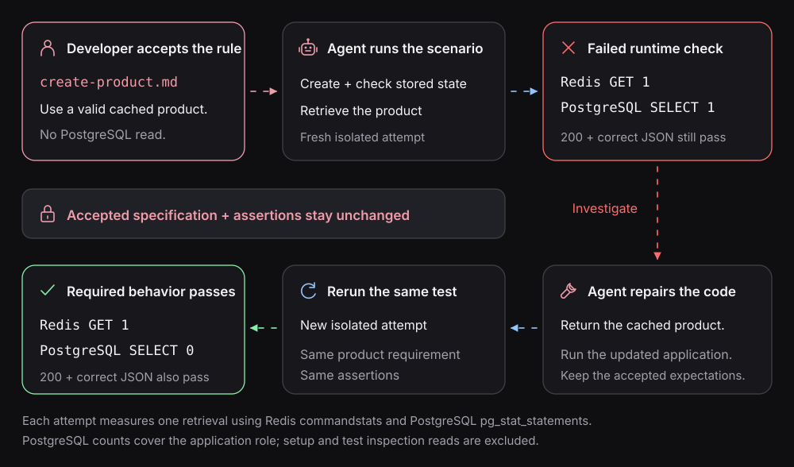

# Investigate with a Capsule, confirm with Playwright

A failing system test tells you *what didn't match the expectation*. It may not tell you why. That's
where a **Capsule** helps your coding agent investigate the running system before changing the
implementation.

A Capsule is a bounded, isolated environment for running commands, inspecting results, and recording
runtime observations. **Playwright** is where you preserve reviewed expectations as repeatable
system tests. They both use Blackbox's underlying system setup; they are **different executions**,
not two views of a shared live container.

<p align="center">
  
</p>

## Make the question smaller

Suppose a valid-cache request returns the right product but unexpectedly queries PostgreSQL. Don't
start by inspecting every service and every trace. Ask a narrow question:

> With this product already cached, does retrieving it cause the application to read PostgreSQL?

Select the **smallest real system that can answer it**:

- Keep the product service, Redis, PostgreSQL, and the observations needed to detect the read.
- Omit unrelated services only if their removal doesn't change the behavior or hide evidence.
- Record any external or replaced dependency. A test double changes what the result can establish.

This is how we apply the idea of making
[hard-to-verify problems more testable](https://www.kipiiler.me/blog/verification-systems-llms-ai-agents).
Smaller is helpful **only when the selected boundary still preserves the relevant behavior**. A
dependency diagram by itself cannot prove two systems behave equivalently.

<p align="center">
  
</p>

## Run an experiment

In a configured checkout with the Capsule CLI selected, the current command families are:

```sh
blackbox capsule up <system-id> --json
blackbox capsule run --session <session-id> -- <command...>
blackbox capsule show <session-id>
blackbox capsule report <session-id>
blackbox capsule down <session-id>
```

Replace the placeholders with the **actual catalog system, recorded session ID, and an approved
command**. Capture the `sessionId` from `up --json`; don't pick the newest session by guesswork.
`capsule run` can use a configured driver to perform an HTTP stimulus or inspect state.

For individual activities, use the ID returned by the run. The detailed CLI and identity rules live
in the
[Capsule experiment reference](../../packages/capsule/skills/capsule/references/capsule-experiments.md).

A useful experiment records:

| What                                      | Why it matters                                                                |
| ----------------------------------------- | ----------------------------------------------------------------------------- |
| Known starting state                      | A previous attempt's data cannot be assumed                                   |
| Stimulus and activity ID                  | Identifies the action being investigated                                      |
| Response, state, and runtime observations | Shows *what* happened, not just whether a command exited successfully         |
| Completion and observation limits         | Distinguishes a missing operation from an operation the observer couldn't see |
| Cleanup result                            | Shows whether Blackbox released owned resources                               |

Stopping the Capsule releases its resources but preserves the retained record and report.

## From an observation to an accepted check

A surprising Redis or SQL observation can reveal a bug—or an incorrect assumption about the
requirement. The agent should compare it with the **accepted specification** before turning it into
a permanent test.

For the cache-hit example, the specification already prohibits PostgreSQL reads. The agent can
repair the implementation and run the unchanged [Playwright scenario](verify-a-specification.md).

<p align="center">
  
</p>

If an experiment discovers a genuinely new requirement, ask for approval first. **Observed behavior
is not automatically expected behavior.**

## Keep verification cheap enough to repeat

An agent can implement several alternatives quickly. A verification environment that takes hours to
rebuild for every attempt defeats the benefit. Reuse the reviewed expectation, select the relevant
system boundary, inspect a focused result, and rerun after a repair.

That's our application of
[the asymmetry of verification](https://www.jasonwei.net/blog/asymmetry-of-verification-and-verifiers-law):
investing in a reliable check can make evaluating the next implementation cheaper. **Blackbox
doesn't promise that every distributed-system property is quick or completely observable.**

[First business verification](verify-a-specification.md) ·
[Repair from evidence](repair-from-evidence.md) ·
[Why verification matters now](../concepts/why-verification-now.md)
