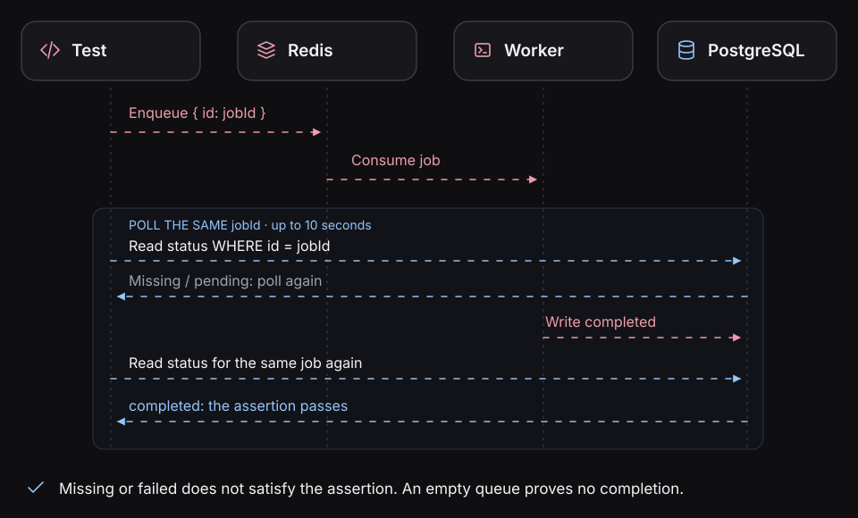

# Wait for an outcome only when the specification allows it

The product specification requires persistence and cache population when creation
succeeds. Its tests therefore check those results immediately after the `201`
response. Adding retries there could hide a violation of the accepted rule.

Some requirements allow an outcome to become visible later. For those, agree on
the expected state and completion deadline, then use a bounded assertion to wait
for that state. Keep the action and the observation tied to the same resource.

## Completion depends on the entrypoint



*This diagram illustrates a queue-style completion contract; it is not a built-in Blackbox queue adapter.*

An HTTP response might precede work on a queue; a message might be
acknowledged before a projection becomes visible; a scheduled job may
return after merely enqueuing another task.

The accepted specification must say what **business completion**
means. For a queued invoice, it might require an authoritative invoice
record and downstream publication evidence. Broker acknowledgment
alone cannot establish all of those outcomes.

The sample below uses HTTP and PostgreSQL. The queue and job examples
are **evidence-design guidance**, not a claim that the alpha includes
universal queue/scheduler adapters or effect matchers.

[Outcomes and completion](../concepts/behavioral-evidence.md).

## Use Playwright's polling assertion

`expect.poll` is a [native Playwright assertion](https://playwright.dev/docs/test-assertions#expectpoll).
Blackbox exports Playwright's extended `expect`, including this API:

```ts
import { expect } from '@suites/blackbox-playwright';
```

The callback runs repeatedly until its returned value satisfies the matcher or
the deadline expires. The callback should observe state; issue the business action
once, outside it.

For example, the product sample's real PostgreSQL schema and
[native observation client](testing-postgres.md#register-the-native-pool) support
this assertion inside a native scenario with `api` and `db` registered. `product`
is the expected product submitted by that scenario:

```ts
await expect
  .poll(
    async () => {
      const result = await clients.db.query(
        'SELECT id, name, price_cents AS "priceCents" FROM products WHERE id = $1',
        [product.id],
      );
      return result.rows;
    },
    {
      timeout: 10_000,
      intervals: [100, 250, 500],
      message: `Product ${product.id} reaches its expected stored state`,
    },
  )
  .toEqual([product]);
```

This uses the existing product table and `pg` client's query method. The selected
ID and complete row comparison prevent an unrelated or incomplete product from
satisfying the assertion. A missing row keeps returning `[]` and fails at the
deadline. A connection error also cannot establish the expected state.

The ten-second timeout is an example, not part of the product's accepted rule.
Use this form only when the specification permits eventual visibility and supplies
an appropriate deadline. The [main product suite](../../e2e/product-cache/tests/product-cache.native.spec.ts)
keeps its stronger, immediate state checks.

## Keep the finding within its scope

A passing row assertion establishes that the expected state became visible. It
does not establish cache population or whether a retrieval avoided PostgreSQL.
Those remain [separate observations](testing-redis.md).

Keep observation queries outside the cache-retrieval measurement window. The
sample's read-only observer role is distinct from the application role, and its
clients and isolated state belong to the current Sandbox attempt.

Return to [the evidence checkpoint](verify-a-specification.md#read-the-evidence)
with the outcome, its resource identity, and the deadline it satisfied. If it
fails, investigate the actual state before changing the accepted expectation.
