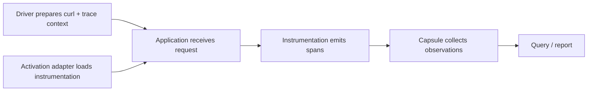
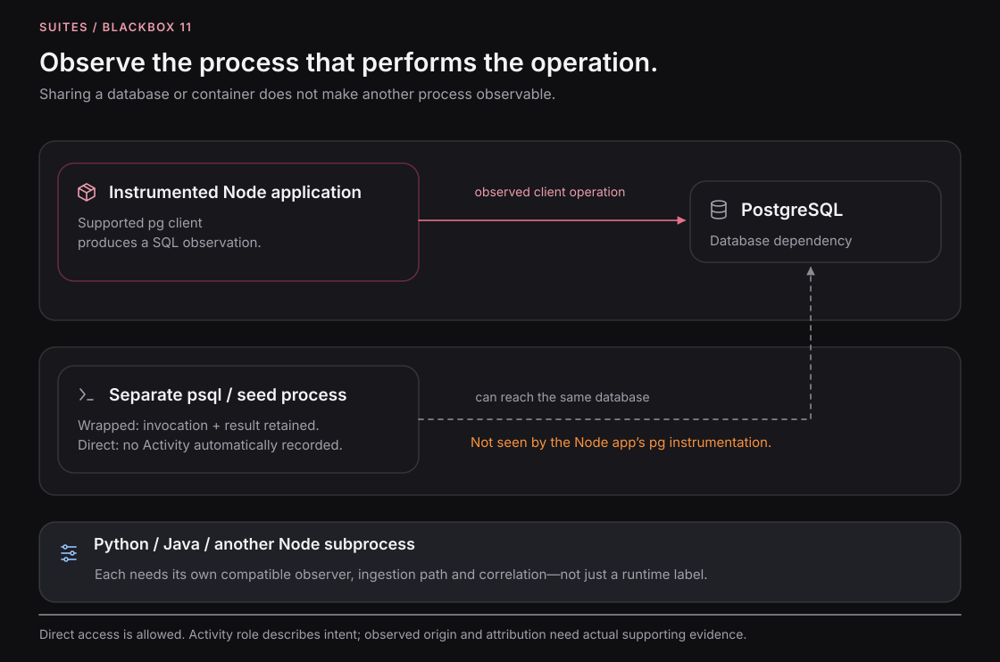

# Instrumentation and activation adapters

Instrumentation makes application behavior observable. It runs inside an application process and emits telemetry
for supported operations, such as an HTTP request or database client call. Blackbox collects that telemetry so you
can inspect it alongside your Capsule activities.

An **activation adapter** tells Blackbox how to load the instrumentation when a participant starts. A **driver**
prepares an operator's command. You often use both: the driver adds trace context to a request, and the instrumented
application carries that context into its spans. Context improves association; observations can still be execution
evidence when the path crosses a boundary that does not carry trace context.



## Install Node instrumentation

From the directory containing your application's `blackbox.config.yaml`:

```sh
blackbox inst install --runtime node
```

The installer creates a project-local bootstrap and installs its dependencies:

```text
.blackbox/instrumentation/
├── package.json
├── instrumentation.js
└── node_modules/
```

You can repeat the command. When the managed files and dependencies are current, the installation is left unchanged.
If a managed file has been edited, the installer reports a conflict and preserves it. Installation prepares the files;
the catalog's activation configuration determines which processes load them.

The [subscription walkthrough](experiments.md) repeats installation to demonstrate this behavior before starting
any application containers.

## Connect a participant to an activation

Declare an activation at the root of `blackbox.config.yaml`:

```yaml
activations:
  sut-node-factory:
    ref: .blackbox/instrumentation/instrumentation.js
    adapter: node-preload
    version: 1
```

Then reference it from each Node participant you want to instrument. This excerpt belongs under a catalog entry's
`participants` mapping:

```yaml
participants:
  public-api:
    service: public-api
    role: entrypoint
    runtime: node
    activation: sut-node-factory
```

`sut-node-factory` is a name chosen by the project, not a reserved adapter name. Several participants can reference
the same activation. The application example uses it for `public-api`, `fraud-check`, `order-service`,
`payment-mock`, and `redis-proof-consumer`.

At startup, Blackbox mounts the instrumentation directory read-only into the configured containers, loads the bootstrap
through `NODE_OPTIONS`, and supplies the collector endpoint and session-specific telemetry settings. The bootstrap
acknowledges activation with its runtime and service identity. Capsule startup checks those configured activations
as well as application readiness.

The referenced bootstrap must be inside the project's `.blackbox/instrumentation/` directory.
See the [complete example catalog](../e2e/blackbox.config.yaml) for placement.

## Choose an adapter

| Adapter            | Where it is configured                  | What it does                                                                                             |
| ------------------ | --------------------------------------- | -------------------------------------------------------------------------------------------------------- |
| `docker-compose@1` | A catalog entry's `acquisition.adapter` | Starts the selected services from ordinary Compose files.                                                |
| `node-preload`     | An activation's `adapter`               | Loads the Node bootstrap with `--require`. Use it for the CommonJS application example.                  |
| `node-esm`         | An activation's `adapter`               | Adds OpenTelemetry's experimental ESM loader hook and preloads the bootstrap for ES module applications. |

The acquisition adapter creates the environment. The activation adapter loads instrumentation into a process in that
environment. Selecting `docker-compose@1` alone does not instrument services.

Use the adapter for the JavaScript the application actually executes. An application authored in TypeScript but
compiled to CommonJS follows the CommonJS path. `node-esm` uses Node's experimental loader mechanism; check it with
your application's Node version and module setup.

These are the supported acquisition and Node activation adapters. An arbitrary string in the catalog is not a
registered adapter implementation. Python and Java instrumentation installation are outside the current alpha scope.

## Verify that observations arrive

The stages answer different questions:

| Stage                      | What you have established                                              |
| -------------------------- | ---------------------------------------------------------------------- |
| Install instrumentation    | The bootstrap and dependencies are present.                            |
| Validate the catalog       | The configuration and referenced files pass validation.                |
| Start the Capsule          | The selected environment reaches its configured startup checks.        |
| Inspect activation records | The expected instrumented runtime and service acknowledged activation. |
| Receive observations       | The collector retained telemetry from a running process.               |

After making an application request, query the session:

```sh
blackbox observations --session "$SESSION_ID" --json
```

Inspect activation identities and telemetry status. Export can be asynchronous, so query again if observations have
not arrived yet. Receiver readiness, runtime activation, and received telemetry do not establish complete capture
of every operation.

## Understand the observation boundary

[](assets/figures/11-instrumentation-boundaries.svg)

_Instrumentation follows the process doing the work. A retained `psql` result can still be state evidence even when
that command has no application-side span. The runtime examples in this conceptual figure do not imply available
Python or Java installers._

Instrumentation follows the process and supported library. A Node service's PostgreSQL client can emit spans while
a separate `psql` command against the same database produces only a command result. Declaring PostgreSQL or Redis
as a participant does not instrument every client that accesses it.

The collector receives trace data using OTLP over HTTP with JSON encoding. Configuring an unrelated exporter for
binary protobuf or gRPC will not make it compatible with this receiver. Capsule supplies the matching exporter
configuration for its Node activation path.

For request-to-activity correlation, read [drivers and propagation](drivers.md). For interpreting empty or partial
results, read [runtime evidence](runtime-evidence.md).
