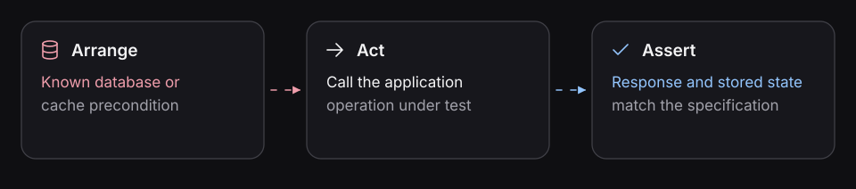

# Express accepted behavior in native Playwright

Native tests are where an agent can express project-specific behaviors
using real SDK calls and assertions. After a [Capsule rehearsal](../guides/investigate-with-capsule.md),
the agent can turn the observed preconditions and effects into repeatable checks
against a fresh Sandbox.

**Two contracts must stay separate:** a Feature-compiled suite is deterministic
and must not be hand-edited. An editable Playwright **scaffold generator is planned**;
today the agent can write and maintain a project-owned native suite directly.
See [Editable scaffolds](editable-scaffolds.md) and the
[full spec-first workflow](../guides/from-spec-to-verification.md).

Native Playwright is a **first-class Spec-Driven Verification path**.
Write executable expectations in TypeScript, operate the application
through your project's SDKs, and assert the response, state, and bounded
runtime operations the accepted specification requires. Blackbox supplies
an isolated Sandbox per attempt, resolved client endpoints, and retained
execution diagnostics.

Gherkin Features are useful review surfaces in SDD, but **optional**.
Whether native or generated, the human-approved behavior remains fixed
while the agent investigates and repairs an implementation.

The [product walkthrough](../guides/verify-a-specification.md) follows this
accepted behavior: creating a product stores it in PostgreSQL and Redis; retrieving
the cached product returns it without reading PostgreSQL. Use that complete
walkthrough for setup, execution, and evidence. This page explains how its native
test preserves the rule and how to apply that structure to another requirement.

## Start from the claim, not the SDK

Ask what each assertion must establish. In the product example,
creation status does not establish a committed PostgreSQL row, and
a cached Redis value does not establish that retrieval avoided PostgreSQL.
Each claim needs an observable source, a known initial state, and an
appropriate completion condition.

[Behavioral evidence](../concepts/behavioral-evidence.md).

## Keep the rule visible in the test




Read the [accepted product specification](../../e2e/product-cache/specs/create-product.md)
beside the [canonical native suite](../../e2e/product-cache/tests/product-cache.native.spec.ts).
The suite groups the capability, rule, and scenarios with ordinary Playwright
declarations. The Feature → Rule → Scenario hierarchy is useful in native tests;
writing a `.feature` file is optional.

Both scenarios belong to **Rule: Persist products and serve valid cache
entries**. Each has its own Arrange, Act, and Assert phases:

| Scenario                  | Arrange                                                                                        | Act                                    | Assert                                                                                      |
| ------------------------- | ---------------------------------------------------------------------------------------------- | -------------------------------------- | ------------------------------------------------------------------------------------------- |
| Create a product          | Establish a fresh product system.                                                              | Submit the product to the API.         | Check the creation response, committed PostgreSQL row (C1), and populated Redis entry (C2). |
| Retrieve a cached product | Create the product, establish its stored and cached state, and prepare the observation window. | Retrieve that product through the API. | Check the response and the retrieval's cache/database observations (C3).                    |

The second scenario must establish its own precondition. It cannot borrow a
product created by another test: each physical attempt owns a separate Sandbox.
Keep the accepted rule unchanged while investigating a failing assertion.

The sample uses HTTP fixture operations for state inspection and its bounded
retrieval observation. Those operations belong to the sample application. The
test can also use [PostgreSQL](../guides/testing-postgres.md) and
[Redis](../guides/testing-redis.md) SDK clients when your application's evidence
requires direct access.

## Separate connection setup from behavior

The [sample client](../../e2e/product-cache/tests/clients.ts) uses `defineClient`
to bind the exported `api` definition to the `product-service` participant on port
`3000`. It creates an authenticated request context using that attempt's endpoint
and fixture token. The tests register it in `system.sandbox(...)` and call
`clients.api` using the ordinary request SDK.

`test.system('product-system', ...)` selects the catalog boundary.
`suite.describe(...)` names the capability and rule, and `suite.test(...)` names
each scenario. The injected `step` function records the scenario's work in the
native report while maintaining Blackbox's attempt context.

Blackbox readies and disposes registered clients. The application owns its schema,
fixture meaning, authentication, and observation operations. See the
[client and fixture reference](clients-and-fixtures.md) for SDK registration,
per-test hooks, custom fixtures, and lifecycle details.

## Run the same reviewed expectations

After completing the [walkthrough's preparation](../guides/verify-a-specification.md),
run these commands from `e2e/product-cache/`:

```sh
pnpm --dir .. exec playwright test --config product-cache/playwright.config.ts --project native --list
pnpm --dir .. exec playwright test --config product-cache/playwright.config.ts --project native
```

The native project selects the two business scenarios. Check their individual
results and named steps, then return to
[Read the evidence](../guides/verify-a-specification.md#read-the-evidence). A
scenario that stops at a failed assertion has not established its later claims.
Setup and cleanup outcomes also belong to the attempt's result.

## Ask the agent to add another scenario

Give the agent the accepted requirement, the existing suite, and the observation
needed to distinguish correct behavior:

> Extend the native suite with a scenario for this accepted requirement. Keep
> its rule and Arrange, Act, Assert phases visible. Establish its precondition
> within its own attempt, and identify the response, state, or runtime evidence
> needed by each claim. Run the scenario and report any claim that remains
> unchecked.

An SDK call is an action or observation, not an acceptance criterion by itself.
For example, a Redis `GET` that returns the expected value establishes cache
state. It does not establish that the application's retrieval avoided PostgreSQL.
The [cache evidence guide](../guides/testing-redis.md) explains that distinction.

Continue with [repairing the implementation from evidence](../guides/repair-from-evidence.md).
Use the same native suite during local iteration and in the repository's CI
selection. If your team also wants reviewed Gherkin, the optional
[Feature workflow](../features/drafting-feature-files.md) generates native suites
that use the same runtime and reporting path.
