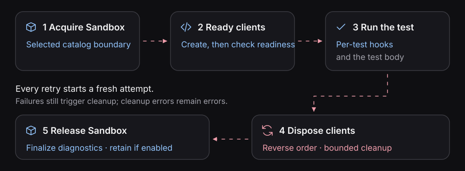

# Client and fixture reference

Clients are **action and observation mechanisms** for executable
specifications. Choose them because they can act at a relevant entrypoint
or supply evidence for a behavioral claim, not merely because a service
has an SDK.

The [product walkthrough](../guides/verify-a-specification.md) requires
HTTP stimuli and independent state/operation observations. Its
[API client](../../e2e/product-cache/tests/clients.ts) is a starting
point. A connected SDK is not itself a test oracle: the accepted
specification still determines the expectation.

The [PostgreSQL](../guides/testing-postgres.md) and [Redis](../guides/testing-redis.md)
guides show native observation clients for the same product system. Choose a
client because its action or observation helps establish a claim in your
specification, then return to the walkthrough's
[evidence checkpoint](../guides/verify-a-specification.md#read-the-evidence).

## Action and observation are different responsibilities

| Client role             | What it can establish                                            |
| ----------------------- | ---------------------------------------------------------------- |
| **Action**              | A request, message, or command was submitted to a named boundary |
| **Outcome**             | What the target reported through the client                      |
| **State inspection**    | What a separate resource exposed at a recorded moment            |
| **Runtime observation** | What an available observer recorded during the selected action   |

A queue acknowledgment may not establish downstream business completion.
Instrumentation of the test runner does not automatically observe operations
performed by an uninstrumented service. Keep the claim's evidence and
completion requirements explicit.

[Behavioral evidence model](../concepts/behavioral-evidence.md).

## Define a client

`defineClient(sdk, definition)` connects any suitable SDK to a catalog
participant. Its lifecycle contract is the same across protocols:

| Field     | Purpose                                                                  |
| --------- | ------------------------------------------------------------------------ |
| `target`  | Select the catalog participant and container port.                       |
| `env`     | List required values from that participant's container environment.      |
| `create`  | Build and return a client using the SDK, endpoint, and requested values. |
| `ready`   | Establish the connection or verify it can serve the test.                |
| `dispose` | Release the client and its connections.                                  |

Use the [PostgreSQL](../guides/testing-postgres.md#register-the-native-pool),
[Redis](../guides/testing-redis.md#connect-a-native-client), or
[HTTP](../guides/testing-http-apis.md#connect-the-api-client) guide for a complete
definition. Register definitions by name in the Sandbox options, for example
`{ clients: { api, db } }`. The callback receives their typed instances.

Blackbox resolves the participant name to its Compose service and maps the
requested port. Only the environment keys listed in `env` reach `create`; a
missing value fails setup. These values come from the target container, not the
test runner's `process.env`.

Use `endpoint.host` and `endpoint.port` for database and messaging SDKs, or build
the protocol URL your SDK expects. The current endpoint's `url` and `protocol`
use HTTP. See the focused guides for complete
[HTTP client](../guides/testing-http-apis.md#connect-the-api-client) and
[bounded polling](../guides/testing-async-flows.md) examples.

The registry key controls the fixture name: `{ clients: { db } }` exposes a
PostgreSQL `Pool` as `clients.db`; `{ clients: { database: db } }` exposes it as
`clients.database`. Keep concrete definitions in the registry to preserve type
inference. Use the [testing guides](../guides/README.md) for seeding, stimuli, and
state assertions.

## Understand attempt ownership

Every physical test attempt, including a retry, follows this lifecycle:



All registered clients initialize even when a callback does not destructure
`clients`. If a client's readiness check fails, Blackbox still attempts to dispose
it and the clients already created. Client disposal is bounded, and one disposal
failure does not prevent later disposal attempts. If `create` throws before
returning its client, that function must release any resources it already opened.

Sandbox cleanup is requested after assertion failure, timeout, skip,
interruption, and setup failure. Cleanup errors remain errors. Await your
workflow's completion boundary before asserting its state; a response or a span
count alone may not mean asynchronous work has finished.

Use `suite.beforeEach` and `suite.afterEach` for work that needs the current
clients or Sandbox. A Sandbox suite has no `beforeAll` or `afterAll`: it has no
shared live Sandbox. Root `test.beforeAll` and `test.afterAll` remain available
for setup unrelated to an attempt.

## Name work with the step fixture

Use the injected `step` function in tests and per-test hooks. It creates a native
Playwright report step, returns the callback's value, and maintains Blackbox's
attempt context through nested asynchronous steps:

```ts
const rows = await step('Read stored state', async () => {
  const result = await clients.db.query('SELECT 1 AS value');
  return result.rows;
});
expect(rows).toEqual([{ value: 1 }]);
```

Native `test.step` and `suite.step` remain available. They do not add the injected
fixture's attempt context. Registering an SDK does not automatically propagate trace headers or produce
normalized effects. Do not retain the injected `step` function
for use after its attempt has ended.

## Use ordinary Playwright fixtures

Extend the exported `test` to add project fixtures before declaring systems.
For example, expose the current attempt identity to a helper:

```ts
import { test as base } from '@suites/blackbox-playwright';

export const test = base.extend<{ attemptId: string }>({
  attemptId: async ({ sandbox }, use) => {
    await use(sandbox.executionId);
  },
});
```

Tests declared through this `test.system(...)` receive `attemptId` alongside
`sandbox`, `clients` when registered, and the normal Playwright fixtures.

The ordinary `request` and `page` fixtures also remain available. Their configured
`baseURL` is unchanged. To address the current Sandbox, resolve the path with
`new URL(path, sandbox.entrypoint.url).href`. The
[product sample](../../e2e/product-cache/tests/clients.ts) registers a separate
request context whose `baseURL` is the resolved target.

A fixture depending on `sandbox` must remain scoped to a test. Keep SDK lifecycle
in `defineClient` when it needs the registered target and typed client registry.

## Inspect the attempt

| Fixture     | Use                                                                                                                             |
| ----------- | ------------------------------------------------------------------------------------------------------------------------------- |
| `sandbox`   | Read attempt identity, catalog selection, entrypoint, containers, and artifact directory. Lifecycle stays owned by the fixture. |
| `telemetry` | Inspect collector status or read retained session and trace data.                                                               |
| `effects`   | Access the attempt's effect-evaluation boundary.                                                                                |

The current Alpha does not project raw telemetry into normalized effects by
default. `expect(effects).toSatisfy(...)` therefore reports an inconclusive failure
unless the runtime supplies an evaluator. Native response and state assertions
are available independently of that boundary.

For a worked inspection, return to
[Read the evidence](../guides/verify-a-specification.md#read-the-evidence). See
[the repair workflow](../guides/repair-from-evidence.md) for retaining failed and
repaired attempts, or [Feature suites](../features/README.md) to reuse HTTP
clients from Gherkin.

## Select a system or subsystem

`test.system('product-system', ...)` selects the product sample's catalog entry
with `kind: system`. To select a subsystem in your application, use an explicit
selector such as `test.system({ kind: 'subsystem', id: 'orders' }, ...)`; that
subsystem must exist in your catalog. The ID and kind must match the configured
entry. Declaration callbacks are synchronous; test and per-test hook callbacks
can be async.

## Database setup

Parameterize SQL values and keep table/column identifiers fixed or allowlisted.
For a multi-statement seed, get one connection with `clients.db.connect()`, run
`BEGIN`, the statements, and `COMMIT` on it, roll back on failure, and release it
in `finally`. Separate `pool.query` calls can use different connections.

Commit setup before the application acts: an uncommitted seed is not visible to
its separate connection. Rolling back the seed connection cannot undo work the
application committed. Use attempt isolation or explicit owned-state cleanup.

`pg` can return PostgreSQL `numeric` and `bigint` as strings. Assert the actual SDK
value type. Readiness with `SELECT 1` establishes connectivity; migrations must
establish application schema.

## Redis state

| Shape  | Read with            | Assertion consideration                                          |
| ------ | -------------------- | ---------------------------------------------------------------- |
| String | `get(key)`           | Compare the exact string, or parse JSON deliberately.            |
| Hash   | `hGetAll(key)`       | `toEqual` also rejects unexpected fields.                        |
| List   | `lRange(key, 0, -1)` | Check complete contents and order.                               |
| Expiry | `pTTL(key)`          | Positive milliseconds remain; `-1` is permanent, `-2` is absent. |

For eventual application writes or expiry, use bounded polling on the specific
result required by the claim. An empty queue does not establish worker success.

The product sample's cache-only retrieval assertion uses a bounded observation
window. Keep test-side Redis reads outside that window; otherwise their commands
would contaminate the application's count. See the
[cache evidence guide](../guides/testing-redis.md#observe-the-retrieval-within-a-bounded-window)
for the observation contract and its limits.
