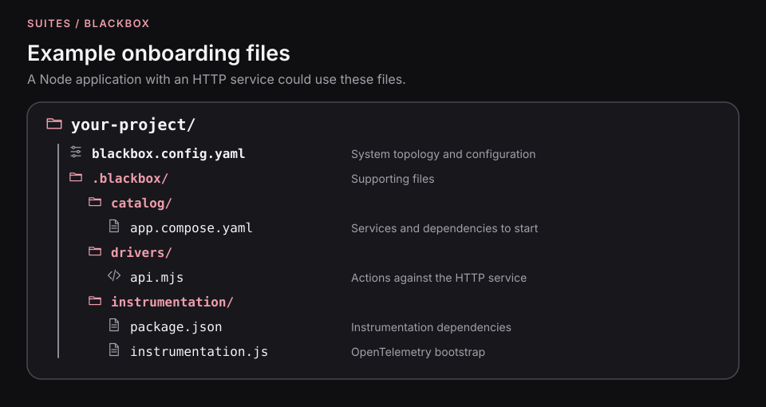
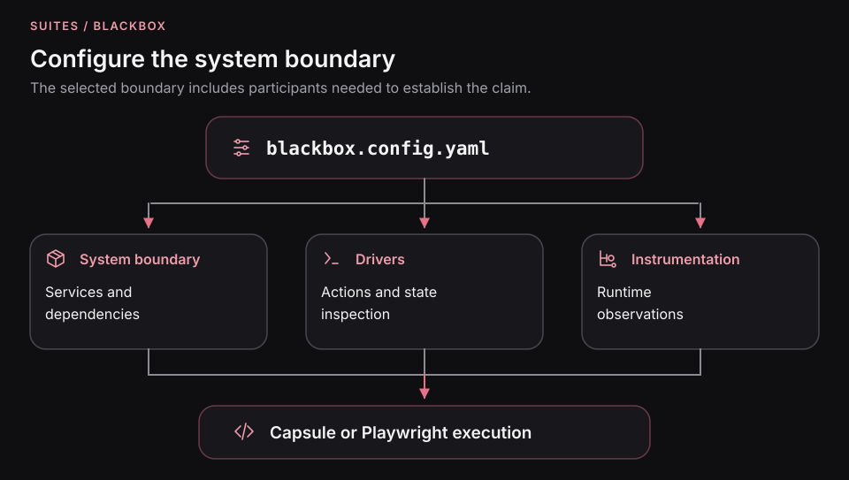

# Connect your application to an accepted requirement

Start with **accepted behavior**, not a Compose file. Give the agent the
specification and ask which running-system evidence could establish its
claims. Then discover the smallest runnable boundary, prepare the Sandbox,
and connect its action and observation clients.

The end product is not merely a healthy system. It is **reviewed executable
verification** that measures what the specification requires.
[Why this ordering matters](../concepts/spec-driven-verification.md).

The [product walkthrough](../guides/verify-a-specification.md) supplies a complete
application. Follow this guide when adapting the same process to your repository.
For its create/read rule, the agent must account for the API, PostgreSQL, Redis,
and evidence that a cache-hit retrieval avoids a database read.

This candidate-alpha integration requires the pending typed Playwright client API.
Its execution steps require compatible builds containing that API; this checkout
does not yet supply them. See [current availability](../../README.md#alpha-and-further-guides).

## Give the agent the specification

Supply the accepted document, ticket, or API contract. For the product example,
the [specification](../../e2e/product-cache/specs/create-product.md) requires
creation to persist and cache the product, followed by cache-only retrieval.

Ask the agent to identify the evidence each claim needs:

| Accepted claim                                  | Setup and observation to discover                                                               |
| ----------------------------------------------- | ----------------------------------------------------------------------------------------------- |
| Creation commits the product                    | Schema/migrations, an isolated product ID, and a separate committed-state read.                 |
| Creation populates Redis                        | The application's cache key/value contract and a way to read that entry.                        |
| Retrieval uses cache without reading PostgreSQL | A known valid cache entry and a bounded observation that can detect application database reads. |

Review this mapping along with the scenario. An HTTP response does not answer all
three questions, and a missing database span alone does not establish absence of
a read. If a required observation is unavailable, keep that claim explicit while
the agent prepares the missing observation surface.

Before creating configuration, have the agent summarize each
**expected behavior → action → observation → completion condition**.
That short map tells you which dependencies really need to be started.
A missing observer is a setup gap, not a reason to weaken the test.

[See the evidence model](../concepts/behavioral-evidence.md).

## Prepare the test project

The agent prepares the startup configuration for your application and its
dependencies, including readiness, migrations, and isolated test state. The
Playwright suite invokes the Sandbox to build and start that configured system,
connect its clients, and release it after each attempt. A running Docker engine
is required for the current adapter.

This integration guide starts with compatible candidate-alpha builds of these
packages already installed in your test project:

| Package                        | Purpose                                                                                 |
| ------------------------------ | --------------------------------------------------------------------------------------- |
| `@suites/blackbox-cli`         | Supplies the `blackbox` executable.                                                     |
| `@suites/blackbox`             | Selects Catalog, Discovery, and Skills.                                                 |
| `@suites/blackbox-playwright`  | Supplies the runner, clients, and reporter.                                             |
| `@playwright/test`             | Supplies Playwright; the adapter requires version 1.61 or later within major version 1. |
| `typescript` and `@types/node` | Check the TypeScript test project.                                                      |

For a first run with the candidate implementation, follow the
[source-checkout prerequisites](../guides/verify-a-specification.md#run-the-supplied-example).
That walkthrough requires both the matching packages and the complete product
sample; their presence cannot be inferred from this guide being in the checkout.
This guide does not specify a published package version for installing the
candidate into an external project.

Select `@suites/blackbox-inst-runtime-node` explicitly when the project needs its
Node instrumentation installer, and `@suites/blackbox-feature` when compiling
Features. Add the native SDK for each additional client, such as `pg` or `redis`.

Run this guide's commands from **your application's test-project root**. The
product sample's commands have their own working directory, `e2e/product-cache/`.

## Choose the smallest useful system—not simply the fewest containers

An agent should build from the behavioral question outward. For the cache
rule, it must keep the product API, PostgreSQL, Redis, and a reliable way to
measure the application's database reads. Starting only the API would make
the test fast but unable to answer the requirement.

Exclude unrelated services when their absence doesn't change the behavior
or remove necessary observations. Mark services that remain external and
any doubles that substitute for real dependencies. A static dependency graph
helps discovery, but cannot by itself establish behavioral equivalence.

This targeted, controlled environment makes experiments and repeated checks
more practical. [Capsule investigation and system boundaries](../guides/investigate-with-capsule.md).

## Let the agent discover and configure the boundary

The agent derives the system topology from the repository and chooses the
smallest real boundary that can establish the accepted claims. That boundary
must include every participant needed for the behavior and its observations.

<p align="center">
  
</p>

Inspect the available skills and install the onboarding skills for your host:

```sh
pnpm exec blackbox skills list
pnpm exec blackbox skills install blackbox --codex
pnpm exec blackbox skills install discovery --codex
pnpm exec blackbox skills install catalog --codex
```

Use `--claude` or `--cursor` instead when appropriate. Once the skills are available
to your agent, give it the accepted specification and this task:

> Set up Blackbox for this accepted specification. Identify each claim,
> its completion condition, and evidence requirements. Discover services and
> dependencies, choose the smallest runnable boundary, and reuse existing
> startup definitions. Prepare the Sandbox, action and observation clients,
> readiness, migrations, and deterministic state. Produce reviewed scenarios
> and list claims that remain unobservable. Do not change expected behavior
> to match the implementation.

The agent reuses existing project files where appropriate. For a Node application
with an HTTP service, the configuration and its supporting files can look like this:

<p align="center">
  
</p>

`blackbox.config.yaml` is the configuration authority. Capsules and Playwright
use the [configured system boundary](../assets/readme/system-boundary.svg), drivers,
and instrumentation to run and observe the selected system. Native test clients
and business scenarios accompany those configuration files.

Review the resulting artifacts with the agent:

| Artifact                                  | What it must explain                                                                                |
| ----------------------------------------- | --------------------------------------------------------------------------------------------------- |
| `blackbox.config.yaml`                    | The named system or subsystem, acquisition files, participants, entrypoint, and observation policy. |
| System startup definitions                | How the Sandbox builds and starts the selected application with isolated dependencies.              |
| Client definitions                        | The SDKs, selected participants, required credentials, readiness, and disposal.                     |
| Fixture or seed helpers                   | How each scenario establishes its own known precondition.                                           |
| Instrumentation or observation operations | Which claims they can establish and how observations are bounded and correlated with the action.    |

The agent includes the dependencies needed by the application and its observation
clients. For configuration details, use the [Catalog reference](../../packages/catalog/README.md).

Validate the configuration:

```sh
pnpm exec blackbox catalog validate --json
```

Expect `"ok": true`. This establishes valid configuration. Running a scenario
still needs to establish readiness, business outcomes, and cleanup.

## Bind a client to the selected service



Suppose discovery found a system named `product-system`, with API participant
`product-service` on container port `3000`, and `GET /health` returning `200`. Replace
these names and the readiness contract with the actual values in your catalog.

Create `tests/system/clients.ts`:

```ts
import { request } from '@playwright/test';
import { defineClient, expect } from '@suites/blackbox-playwright';

export const api = defineClient(request, {
  target: { participant: 'product-service', containerPort: 3000 },
  env: [] as const,
  create: (sdk, { endpoint }) => sdk.newContext({ baseURL: endpoint.url }),
  ready: async (client) => {
    expect((await client.get('/health')).status()).toBe(200);
  },
  dispose: (client) => client.dispose(),
});
```

Blackbox resolves the host endpoint for the current attempt. Configure your
application's authentication in `create`. The
[sample client](../../e2e/product-cache/tests/clients.ts) requests
`FIXTURE_CONTROL_TOKEN` from its target container and adds a Bearer token for
protected fixture operations. That fixture protocol belongs to the sample.

Keep connection details in the client; keep the business action and its expected
result in the scenario. The [client reference](clients-and-fixtures.md) and
[PostgreSQL](../guides/testing-postgres.md#register-the-native-pool) and
[Redis](../guides/testing-redis.md#connect-a-native-client) examples show how to add
observation clients.

## Check readiness within the verification workflow

Create `playwright.config.ts` at the test-project root:

```ts
import { defineConfig } from '@suites/blackbox-playwright/config';

export default defineConfig({
  blackboxConfigFile: './blackbox.config.yaml',
  testDir: './tests/system',
  workers: 1,
  retries: 0,
  timeout: 180_000,
  reporter: [
    ['list', { printSteps: true }],
    ['@suites/blackbox-playwright/reporter', { sandboxLifecycle: true }],
    ['html', { open: 'never', outputFolder: './playwright-report' }],
  ],
});
```

Each business attempt will establish readiness before running its authored steps.
For a new integration, a small readiness test can isolate connection problems.
Create `tests/system/readiness.spec.ts`:

```ts
import { expect, test } from '@suites/blackbox-playwright';
import { api } from './clients.js';

test.system('product-system', (system) => {
  system.sandbox('default', { clients: { api } }, (suite) => {
    suite.test('the product API is reachable', async ({ clients, step }) => {
      await step('Read application readiness', async () => {
        const response = await clients.api.get('/health');
        expect(response.status()).toBe(200);
      });
    });
  });
});
```

With the agent-prepared configuration in place, discover and execute the readiness
test. The Sandbox performs the configured build and startup during execution:

```sh
pnpm exec playwright test --config playwright.config.ts readiness.spec.ts --list
pnpm exec playwright test --config playwright.config.ts readiness.spec.ts
pnpm exec playwright show-report playwright-report
```

Expect one discovered test, a ready Sandbox, a passing readiness step, and
successful cleanup. A failure before the authored step belongs to acquisition,
instrumentation, or client readiness; inspect `blackbox-diagnostics` on that
attempt. **A passing readiness check establishes connectivity, not the accepted
business behavior.**

## Verify the accepted behavior in your project

Readiness establishes that the system can be reached. Now ask the agent to turn
your accepted requirement into business scenarios under `tests/system/`, using
the configured system and clients.

Review those scenarios against the specification before running them. The
[product walkthrough](../guides/verify-a-specification.md#review-the-executable-expectations)
shows how to connect each claim to its action and observations. Keep your own
project's resource names, endpoints, and expected outcomes.

The [native authoring guide](README.md) preserves the rule and AAA structure in
TypeScript. Choose the [optional Feature path](../features/drafting-feature-files.md)
when the supported HTTP vocabulary and your application's observation operations
can express those claims. Registering an SDK does not extend that vocabulary.

Stay in **your application's test-project root** and discover the suite, then
execute it with the configuration created above:

```sh
pnpm exec playwright test --config playwright.config.ts --list
pnpm exec playwright test --config playwright.config.ts
pnpm exec playwright show-report playwright-report
```

The discovery list must include your reviewed business scenarios. A run containing
only the readiness test has not verified the requirement. In the report, follow
each business scenario into its assertions and observations, including any claim
left unchecked after a failure.

After execution, follow the same
[evidence checkpoint](../guides/verify-a-specification.md#read-the-evidence) and
[implementation repair workflow](../guides/repair-from-evidence.md). Keep the
accepted expectations available throughout the agent's implementation work.
