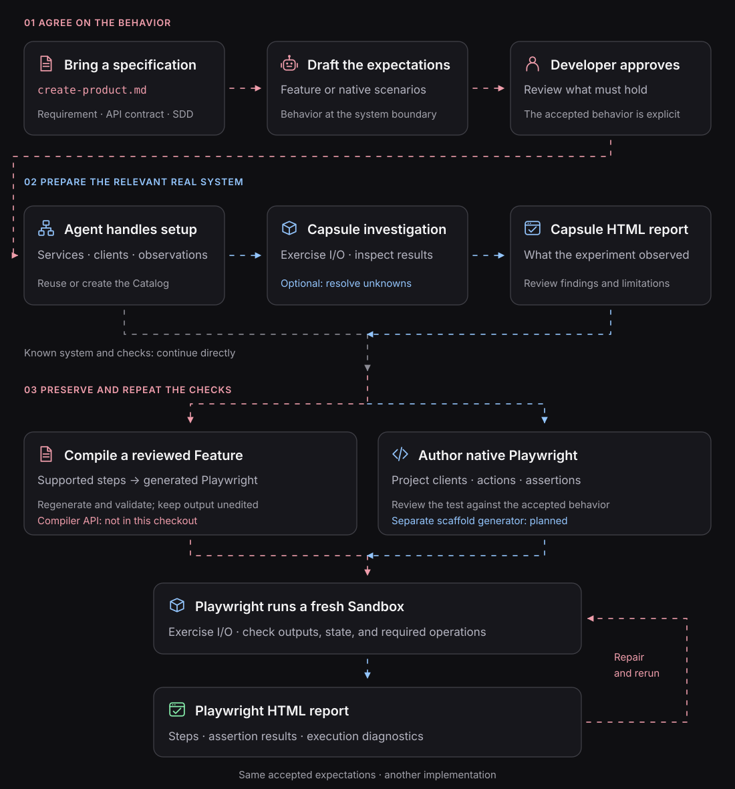

# Editable Playwright scaffolds: the project-owned path

**Status: proposed workflow, not a shipped scaffold-generation command.**

Some accepted requirements fit Blackbox's supported Gherkin vocabulary. Others require custom SDK actions, fixture setup, or observations for which that vocabulary has no sentence yet.

Blackbox should support both without making generated code a mutable source of truth:



## Two distinct authoring contracts

| Deterministic compiler | Editable scaffold (planned) |
| --- | --- |
| Input is a reviewed Feature and its supported step vocabulary | Input is reviewed behavior and, when helpful, Capsule findings |
| Emits a **complete** native Playwright suite for supported operations | Creates a **starting structure** for project-specific TypeScript |
| Output is derived and **must not be edited** | Agent or developer edits and owns the test implementation |
| Byte-level `feature suite validate` guards generated drift | Semantic review and traceability guard the relationship to the accepted spec |
| Implemented in pending [PR #181](https://github.com/suites-dev/blackbox/pull/181) | Generator not implemented or given a final CLI name |

**Don't emit a generated test and then ask the agent to fill in its internals.** That would destroy the deterministic relationship to the reviewed Feature while still giving the file the appearance of compiler authority.

## What the agent should learn in a Capsule

A Capsule rehearsal can establish the actual entrypoint, the initial state the scenario needs, supported client operations, the relevant business identifier, and available observation sources.

Suppose the spec says a valid cache hit must not read PostgreSQL. During exploration, the agent can confirm which endpoint retrieves the product, which keys and rows establish its preconditions, and which observation method detects an application database read. The [Capsule report](../guides/investigate-with-capsule.md) records that experiment and its limitations.

The agent then writes a **separate, reviewed native Playwright test**, not a copy of the experimental command sequence.

## A fail-closed starting structure

The future scaffold should expose unimplemented checks as **failures or explicit unresolved work**, not quietly leave an empty passing test. For example, this is *illustrative project-owned TypeScript*, not generated output from a released command:

```ts
import { test } from '@suites/blackbox-playwright';
import { api } from './clients.js';

test.system('product-system', (system) => {
  system.sandbox('default', { clients: { api } }, (suite) => {
    suite.test('serves a valid cache hit without PostgreSQL', async ({ clients }) => {
      // The agent must establish the initial cached product and
      // implement a reliable, bounded observation of database reads.
      void clients;
      throw new Error('Unimplemented verification: cache-hit PostgreSQL absence');
    });
  });
});
```

Until the agent implements the observed preconditions and assertions, this test **must not pass**. The agent uses the application's own SDKs and observation methods; the actual expected result remains owned by the reviewed specification.

## How traceability should work

An editable scaffold cannot claim the compiler's byte-level Feature-to-suite drift guarantee. Instead, keep a clear link from the accepted spec or reviewed scenario to the owned test, and require explicit review for behavior changes.

A future generator should:

1. Keep the accepted source document and scenario identity visible.
2. Separate **setup**, **action**, and **assertions**.
3. Fail closed on missing required assertions.
4. Let the agent fill in project-specific SDK/client code without changing the accepted expectation.
5. Execute the resulting native test in a new Blackbox Sandbox and show a normal Playwright report.

Avoid silently interpreting arbitrary natural language as an authoritative oracle. Tests must still establish the observable claims under the actual system and evidence boundaries.

## When to use each path

Use deterministic Feature compilation when the step vocabulary expresses the requirement cleanly. Use native Playwright—manually authored today or scaffold-assisted in the future—when the requirement needs richer code.

In both cases, [review the expected behavior](../concepts/spec-driven-verification.md), [experiment when needed](../guides/investigate-with-capsule.md), and [run the final system check](README.md) against an isolated Sandbox.

[Feature compiler and drift](../features/generating-test-suites.md) · [Complete developer workflow](../guides/from-spec-to-verification.md)
