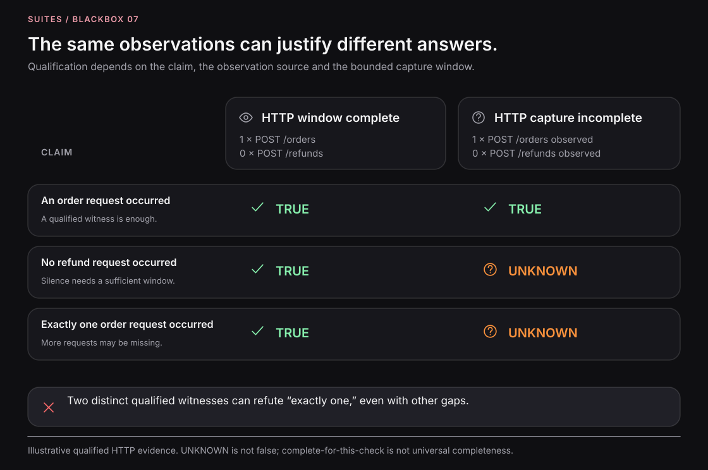

# Interpret runtime evidence

Evidence is an observation considered with its source, execution identity, and the conditions under which it was
collected. Blackbox retains command results and runtime telemetry so you can assess specific claims about an execution.

**Execution identity establishes the evidence scope. Trace continuity is one source of stronger association within
that scope; it is not a prerequisite for an observation to be evidence.**

Start with the [verification model](verification-machine.md) for the distinction between a Capsule, an experiment,
and a trial.

## Match the evidence to the question

| Evidence                           | A question it can answer                                 | What it does not establish by itself                                                    |
| ---------------------------------- | -------------------------------------------------------- | --------------------------------------------------------------------------------------- |
| HTTP response                      | What did the caller receive?                             | Every downstream consequence succeeded.                                                 |
| Command result                     | What did this tool return, and did it exit successfully? | The intended business outcome occurred.                                                 |
| Instrumented runtime span          | Which supported operation was observed?                  | The completeness of all operations, or committed state beyond what the source measures. |
| Database or application state read | What authoritative state was visible at inspection time? | Which particular earlier span caused that state.                                        |
| Driver propagation outcome         | Was context supplied through the declared carrier?       | Every downstream service preserved and exported it.                                     |
| Runtime activation                 | Did a configured runtime/service acknowledge setup?      | All relevant behavior was captured.                                                     |

A successful HTTP response, a downstream request span, and a saved subscription row provide different evidence.
Choose the measurements needed for the claim instead of treating any one of them as a universal success signal.

## Keep association dimensions separate

An observation can have several associations at once:

| Association          | Question it answers                                                           |
| -------------------- | ----------------------------------------------------------------------------- |
| Execution identity   | In which controlled execution was it observed?                                |
| Participant identity | Which service or process supplied it?                                         |
| Activity association | Which deliberate command is it associated with through supported correlation? |
| Trace structure      | Which trace, parent relationship, or link did instrumentation preserve?       |
| Domain identity      | Which job, order, or subscription does the observed data concern?             |

These are complementary facts. An observation on a separate trace can still be evidence from the same execution and
concern the same business entity. Domain identity is usable only when it is actually visible and trustworthy in the
retained data. This table describes how to reason about evidence, not a promise of a new unified artifact schema.

## Investigate shared-state behavior across traces

An **async hole** occurs when work crosses an asynchronous boundary without preserving the trace relationship.
The [Redis walkthrough](async-workflows.md) shows the implemented path: a recorded `redis-cli` stimulus, a consumer,
and a separately traced HTTP interaction retained in the same Capsule session.

Consider a controlled trial with a fresh data store, one worker, no competing producer, a unique job ID, and observation
active before the stimulus:

```text
One controlled execution
├── Initial state: no job 123, worker ready
├── Stimulus: write job 123 into Redis
├── Observation: worker reads job 123       [trace A]
├── Observation: HTTP request for job 123   [trace B]
└── State check: resulting payment record
```

These are illustrative observations, not a claim that every source exposes job IDs automatically.
Separate traces do not disqualify them. Their execution scope, initial conditions, source reliability, business
identities, and completion assumptions determine what they support.

| Claim                                                                              | Evidence needed                                                                                                                   |
| ---------------------------------------------------------------------------------- | --------------------------------------------------------------------------------------------------------------------------------- |
| An HTTP request occurred in this execution.                                        | A trustworthy request witness belonging to the execution. A shared trace is unnecessary.                                          |
| The request concerned job 123.                                                     | Observable, trustworthy domain identity in the request or associated evidence.                                                    |
| Under the stated conditions, submitting job 123 resulted in the expected behavior. | Controlled setup and stimulus, relevant observations, exclusion of competing explanations, and appropriate completion conditions. |
| This exact Redis span directly caused this exact HTTP span.                        | Stronger evidence of the specific causal relationship; execution membership alone is insufficient.                                |
| The payment committed.                                                             | Authoritative payment-state evidence, beyond a request or span alone.                                                             |

The example's Redis driver reports `shared-state-propagation-unsupported`. This describes a propagation limitation,
not unusable evidence. The extended Bash demonstration retains the stimulus and the consumer's separate HTTP trace
within the same session and uses a unique application marker to inspect the resulting behavior.

For a Capsule containing many stimuli, narrower attribution can be ambiguous. Re-establish state, separate trials,
or retain enough additional association to answer the particular claim. A shared session or nearby timestamps alone
do not eliminate competing explanations.

## Require completeness according to the claim

You do not need a closed observation interval before any observation can count as evidence.
A trustworthy positive witness can support occurrence even when other observations are missing.

| Claim                                | What can support it                                                                     | What a gap means                                                                      |
| ------------------------------------ | --------------------------------------------------------------------------------------- | ------------------------------------------------------------------------------------- |
| At least one order request occurred. | One admissible request witness.                                                         | Other missing spans need not invalidate that witness.                                 |
| Exactly one order request occurred.  | One distinct occurrence plus sufficient coverage and completion for the relevant scope. | Another request may be missing. Two distinct witnesses already refute exactly one.    |
| No refund request occurred.          | Sufficient observation coverage over the relevant scope and completion conditions.      | An empty query alone is insufficient. One trustworthy refund witness refutes absence. |
| No relevant errors occurred.         | Adequate coverage of the error sources required by the claim.                           | No observed span errors does not establish that the application had no errors.        |

[](assets/figures/07-evidence-qualification.svg)

_Conceptual evidence qualification: true, false, and unknown correspond to supported, refuted, and insufficient evidence
for a stated claim. This illustration is not output from an implemented alpha claim evaluator._

Ordering also needs suitable evidence. Array position, incomparable clocks, or unlinked traces alone do not establish
a cross-service sequence. Closing a collector gracefully establishes neither that all application work finished nor
that every relevant observation arrived.

## Query the scope you need

The current commands let you read:

```sh
blackbox observations --session "$SESSION_ID" --json
blackbox observations --session "$SESSION_ID" --activity "$ACTIVITY_ID" --json
blackbox observations --session "$SESSION_ID" --trace "$TRACE_ID" --json
```

Use session scope to inspect the retained execution broadly. Activity and trace queries narrow that view by supported
runtime correlation. An activity query can omit relevant execution evidence that arrived on a separate trace; query
the session as well when investigating shared state or background work.

Check response `kind`, identities, activation, and telemetry status. Delivery can lag behind command completion.
Receiver readiness, activation, and `received` telemetry are distinct facts; none establishes universal completeness.

The Node observation path depends on the libraries and instrumentation loaded by each process. The collector accepts
OTLP/HTTP JSON traces; it does not collect arbitrary logs, metrics, or every external client operation.
See [instrumentation](instrumentation.md) and [drivers](drivers.md) for setup and propagation details.

## Report findings without changing the evidence

Keep the observed flow, accepted expectations, and claim assessment separate. Exploring what happened does not
implicitly approve it as correct. Assess previously chosen expectations against fresh evidence when confirming behavior.

The alpha provides raw observations and command results for inspection and explicit checks; general normalized-effect
matchers and automated qualification are in development. Report projections do not create new verdicts.
Use “insufficient evidence” when the available observations cannot answer the claim, rather than forcing pass or fail.

Keep findings bounded to the tested conditions and execution. Review telemetry and delegated output before sharing:
both can contain application data. See [reports](reports.md) for saved snapshots and live views.
