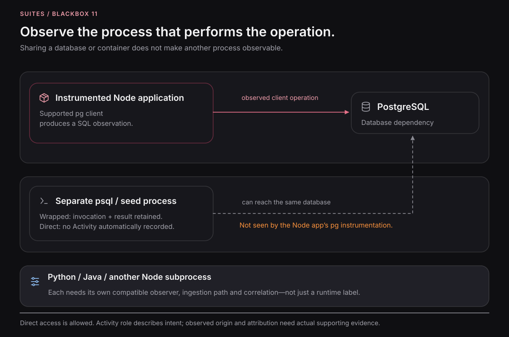

# Instrumentation

Instrumentation observes supported runtime operations. Drivers act on the system; instrumentation observes processes doing the work. They solve different problems.

## Node support

The implemented provider is `@suites/blackbox-inst-runtime-node`. It installs a project-local OpenTelemetry dependency bundle and bootstrap under `.blackbox/instrumentation/`.

```sh
blackbox inst install --runtime node
```

Installation and activation are separate. The Catalog names an activation for each participant that should load the bootstrap. The runtime mounts the assets and extends `NODE_OPTIONS` through the selected adapter.

| Adapter | Intended activation |
| --- | --- |
| `node-preload` | CommonJS preload |
| `node-esm` | Supported OpenTelemetry ESM loader plus preload |

`node-register` is not an audited adapter. Use the bundle's supported runtime versions; the Blackbox development toolchain has its own stricter Node requirement.

## Observe the process that performs the operation



A separately invoked seed process or another language runtime needs its own observer and correlation path. Sharing a database, container network, or runtime label does not make its operations visible through the Node application's instrumentation.

## Capture boundary

The Node bundle provides traces, not OpenTelemetry logs or metrics. Application stdout captured through a command is a separate source. Arbitrary internal function calls and all domain events are not automatically observed.

Activation and readiness are checked independently. A bundle present on disk does not establish that the application loaded it. A successful activation does not establish complete coverage of every supported boundary.

## Installation safety

The provider uses pinned dependencies and disables lifecycle scripts during its standalone dependency preparation. Managed-file conflicts are reported rather than silently overwritten. Do not bypass those conflicts by deleting project-owned files without review.

## Troubleshooting

When observations are missing, check the participant activation, loaded runtime path, supported client library, collector availability, execution identity, and export timing. Do not loosen the claim or infer “did not happen” from missing spans.

Next: [Runtime observations](../verification/runtime-observations.md) · [Instrumentation CLI](../reference/cli/instrumentation.md).

## Source contract

[Implementation](https://github.com/suites-dev/blackbox/blob/9197de5de456285af16e4dcbcf722082217a3989/packages/instrumentation-runtime-node/README.md).

---

[Documentation](../README.md)
