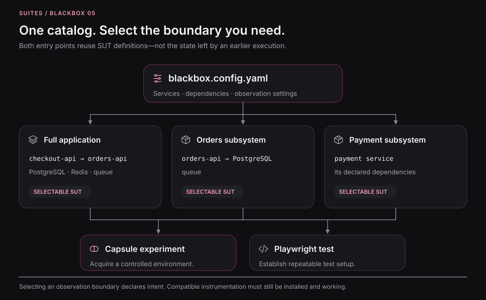

# System boundaries

Run the smallest real system that can answer the behavioral question. Reduction is constrained by the claim, not by a desire to start fewer containers at any cost.

## Start from the question

A payment validation question may need only the payment subsystem and its required data. A subscription-to-order question may need the API, fraud check, payment boundary, order service, worker, and supporting state or messaging resources.

Keep a participant when removing it changes the behavior being verified or removes the evidence needed to judge that behavior. Exclude unrelated services and clearly document the remaining external boundaries.

## Managed and external dependencies

A managed dependency is one whose test lifecycle and relevant state are controlled within the selected environment. An external dependency remains outside that ownership. Dockerizing the application does not make every network service it contacts managed.

A test double can replace a boundary deliberately. It changes the claim: verifying a request sent to a payment double is not verifying production settlement. Record the substitution and the behaviors it preserves or does not represent.

## Reduction procedure

Identify entrypoints, the action's required dependency paths, state used by the decision, expected outputs/effects, and a completion predicate. Remove unrelated participants conservatively. Validate the reduced catalog, run the same accepted check, and inspect what evidence was lost or changed.

A dependency graph helps select candidates but is not a proof of behavioral equivalence. Hidden configuration, background processes, shared state, and external services can invalidate a static reduction.

## Why the boundary matters operationally

A smaller SUT generally reduces startup work, memory demand, telemetry volume, and competing activity. That improves a focused agent loop. A broad flow still needs the relevant real interactions and can run in CI with controlled concurrency.

## Record the scope

The result should name the selected entry, included/excluded participants, replacements, external access, and what the conclusion does not cover. Do not report “the platform passed” when only its payment boundary was exercised.

## Source contract

[Conservative discovery](https://github.com/suites-dev/blackbox/blob/9197de5de456285af16e4dcbcf722082217a3989/packages/discovery/README.md). [Selectable entries](https://github.com/suites-dev/blackbox/blob/9197de5de456285af16e4dcbcf722082217a3989/e2e/blackbox.config.yaml).

---

[Documentation](../README.md)
