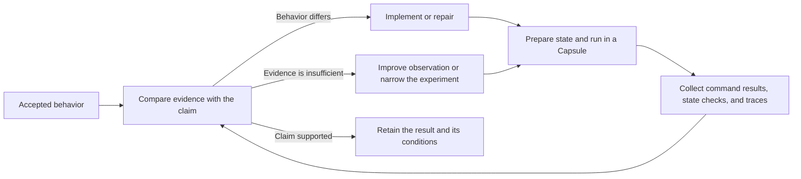
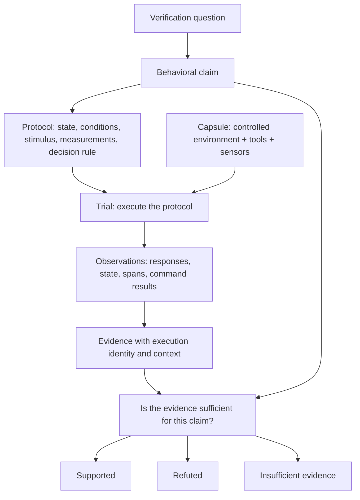

# The verification machine

Blackbox helps you build an environment in which a question about system behavior can be answered with evidence.
Select the relevant services, establish known state, apply a deliberate action, and inspect the resulting execution.

**A Capsule is the laboratory: a controlled runtime environment with tools, observation, and a retained record.
An experiment is the controlled procedure you carry out there to investigate a question or test a behavioral claim.**

For example: “Given a new customer and a valid payment method, does creating a subscription leave an active
subscription in the database?” The Capsule supplies the running system. The experiment defines the starting state,
request, state query, and criteria for answering that question.

## Close the feedback loop: flight control for development

Think of flight control: choose a target, apply a control input, read the instruments, compare the measured response
with the target, and adjust. A coding change is an input to the development loop. Running the changed system gives
you measurements; the accepted behavioral claim tells you what to compare them against.

A Capsule supplies the controlled environment and operating tools that make this loop repeatable. Drivers let you
prepare state and apply inputs. Instrumentation observes supported application operations. Command results, state
queries, and reports let a developer or agent inspect the outcome and decide what to do next.



The **verification machine** is the complete arrangement: the Capsule, an experimental procedure, appropriate
measurements, and explicit checks. The Capsule makes that machine practical by bringing execution and observation
together. It does not choose the correct business behavior or replace the checks that decide whether it happened.

For example, after a subscription change, a successful HTTP response may accompany a missing database row. The
response and a `psql` inspection give the loop useful feedback: investigate persistence, repair, restore the starting
state, and rerun the same procedure. If the row exists but an expected span is missing, first distinguish a behavior
problem from a measurement gap. Changing the expected result merely to match the current output would move the target.

This is flight control as a development analogy, not a separate Blackbox component or an autonomous repair feature.
The current CLI provides execution and feedback; your scripts, tests, or evidence review supply the checks.

## Keep the question, procedure, and result distinct

| Term                  | Meaning                                                                                       | Subscription example                                                                     |
| --------------------- | --------------------------------------------------------------------------------------------- | ---------------------------------------------------------------------------------------- |
| Verification question | What you want to learn about the system.                                                      | Does creating a subscription save an active subscription?                                |
| Claim                 | A specific statement the evidence must support or refute.                                     | Alice has one active subscription after a successful request.                            |
| Experiment protocol   | Initial state, conditions, stimulus, observations, completion conditions, and decision rules. | Start fresh, submit once, wait for completion, query Alice's subscriptions.              |
| Capsule               | The apparatus in which you run the procedure.                                                 | The selected application, dependencies, execution tools, and observation infrastructure. |
| Trial                 | One execution of the protocol.                                                                | This particular request and the evidence collected for this run.                         |
| Evidence              | Retained observations considered with their source and execution context.                     | Response, command results, service spans, and the database query.                        |
| Finding               | What that evidence establishes about the claim.                                               | Supported, refuted, or insufficient evidence.                                            |

An activity is one command within the procedure. A protocol can involve several activities, and a Capsule can host
several investigations. “Trial” describes an execution of your protocol; it is not an additional CLI object or a
synonym for every `capsule exec` call.



This diagram describes the verification model. The alpha supplies Capsule execution, Node observation, command
results, queries, and reports. General normalized-effect matchers, automated claim qualification, and Playwright
integration are still in development. You can apply the procedure using explicit scripts, state checks, and evidence
inspection without pretending the CLI has produced a canonical claim verdict. See [alpha availability](alpha-status.md).

## Make the question easier to answer

A production request competes with other traffic, background work, external services, and unknown state.
A useful experiment deliberately reduces those alternatives:

1. Select the smallest system boundary that still contains the behavior under investigation.
2. Establish and check the initial data and dependency state.
3. Control competing producers, scheduled work, and traffic relevant to the claim.
4. Use a distinctive business identifier when it helps identify the affected job, order, or subscription.
5. Enable the required observation sources before the stimulus.
6. Define when the work is complete and what evidence each claim needs.

A fresh container is useful, but it does not by itself guarantee known data, exclusive traffic, or control over an
external dependency. Those conditions belong to the protocol. Preserve the context needed to understand the result.

## Let execution define the evidence scope

**Execution identity establishes the evidence scope. Controlled state and isolation reduce alternative explanations.
Runtime correlation adds structure inside that scope.**

Suppose a Redis stimulus causes a worker to make an HTTP request on another trace. The HTTP observation still belongs
to the controlled execution. A missing trace link does not remove it from the experiment's evidence.

With known initial state, one producer, an observed job identifier, and appropriate completion conditions, that evidence
may support a system-level claim about the response to the stimulus. It does not automatically establish that one
particular Redis span directly caused one particular HTTP span.

An occurrence claim may already have a sufficient witness before the trial finishes. Absence and exact-count claims
need stronger completeness guarantees. See [runtime evidence](runtime-evidence.md) for these distinctions.

## Use a Capsule for one trial or several investigations

A fresh Capsule, setup, one stimulus, observation, and teardown can provide a clear experimental boundary.
A longer-lived Capsule is useful for exploration, but repeated stimuli and inspection commands can leave background
work or changed state that complicates narrower claims.

For a later trial, record which actions and observations belong to it, re-establish the relevant conditions, or use
a fresh Capsule. A timestamp range alone does not establish exclusive attribution or complete observation.
Blackbox's current activity queries select runtime correlation; they are not an automatic experiment-window model.

A test runner's attempt can be a convenient way to organize a protocol and its claims. Actual isolation still depends
on its configuration. Playwright integration is in progress; it does not create a conceptual restriction on the kinds
of experiments a Capsule can support.

## Separate discovery from confirmation

An exploratory run tells you what happened. It can suggest useful behavioral expectations, but observed behavior
does not become correct merely because it was recorded.

```text
Explore → inspect evidence → explicitly choose accepted expectations
                                     ↓
                  fresh trial → fresh evidence → assess those expectations
```

Keep the accepted expectations independent of the result being judged. Updating an expectation changes the reference;
it does not repair the application or turn the earlier execution into a success. This is a workflow principle,
not a claim that contract promotion or baseline acceptance is implemented in the alpha CLI.

A report of an exploratory run is an **observed flow**. Describe a flow as verified only when named, previously
established claims were checked against sufficient evidence from that execution. State the conditions and scope:
“this trial satisfied these checks” does not establish correctness for every future input or environment.

## Place effects and sensors in the model

The execution produces observations. An effect is a normalized interpretation of supported observations, such as
an HTTP request occurrence. A claim asks what must be established; qualification asks whether the available evidence
is enough to answer it. These are separate jobs.

OpenTelemetry supplies one kind of measurement. A response, process result, or authoritative state read can support
a different claim. A span showing a call to a payment endpoint does not, by itself, establish a committed payment.
The current CLI exposes raw observations and command results; it does not expose the full effect-evaluation pipeline.

[Instrumentation](instrumentation.md), [activation adapters](instrumentation.md#choose-an-adapter), and
[drivers](drivers.md) make the laboratory operable. The [subscription walkthrough](experiments.md) shows how to
combine them into a concrete investigation.

## Background reading

The product model above is Blackbox's application of these ideas, rather than a claim that the articles specify
Blackbox's architecture or APIs:

- Jason Wei explains how work invested in test cases and other checking mechanisms can reduce the cost of evaluating
  candidate solutions. [Asymmetry of verification and verifier's rule](https://www.jasonwei.net/blog/asymmetry-of-verification-and-verifiers-law).
- Hoang Nguyen describes narrowing a problem and constructing an evaluation environment to make difficult verification
  more tractable. [Building Verification Systems for LLMs and AI Agents](https://www.kipiiler.me/blog/verification-systems-llms-ai-agents).
- Birgitta Böckeler connects guidance, feedback sensors, and human judgment in the environment around a coding agent,
  while highlighting the difficulty of validating functional behavior. [Harness engineering for coding agent users](https://martinfowler.com/articles/harness-engineering.html).
