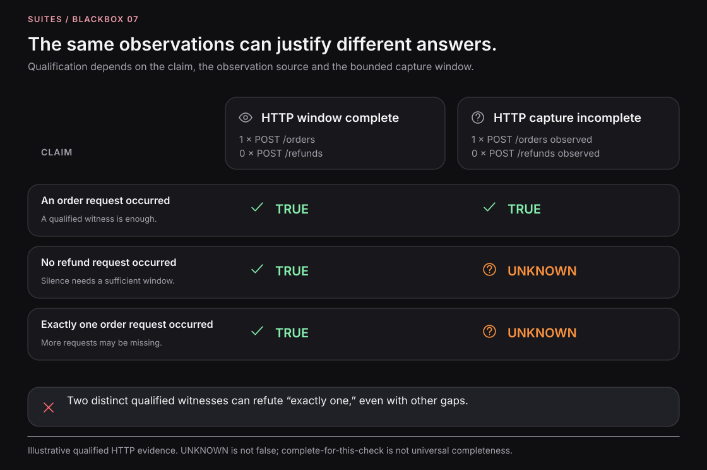

# Evidence qualification

Qualification asks whether the available evidence can answer a particular claim. It depends on the source, identity, capture scope, timing, and the claim itself.

*The figure illustrates reasoning over qualified HTTP observations. It does not represent a universal completeness detector or a currently available command.*

## Occurrence

For “an order request occurred,” one valid, in-scope witness may be enough even while other observations are missing. The witness must establish the claimed event, not just a similar span name or a command that intended to cause it.

For “no order request occurred,” one such witness is a counterexample. A partial capture can therefore refute an absence claim without being sufficient to support it.

## Absence and exact counts

Supporting “no refund request occurred” requires sufficient coverage of that request boundary and a bounded interval that contains the relevant work. An empty list by itself cannot establish either condition.

Supporting “exactly one order request occurred” requires both an occurrence witness and enough coverage to rule out additional requests. Two distinct qualified witnesses can refute that claim even when other data is missing. Do not combine observations from separate physical attempts to reach a preferred count.

## An unanswered claim is not false

A missing witness under incomplete capture may leave a claim unresolved. Preserve the distinction between a refuted claim, unavailable evidence, and a check that never ran. In an automated verification lane, insufficient evidence must not silently become a successful check.

The exact runtime result vocabulary belongs to the installed evaluator. In explanatory docs, “supported,” “refuted,” and “unresolved” describe the reasoning; they are not a fabricated universal JSON enum.

## Review before accepting evidence

Check the artifact's schema and producer, exact execution identity, applicable boundary, completion condition, and known omissions. Digests can identify bytes but do not prove trustworthy origin or complete observation.

Next: [Completion barriers](completion-barriers.md) · [Evidence schema](../reference/evidence-schema.md).

## Source contract

[Implementation](https://github.com/suites-dev/blackbox/blob/9197de5de456285af16e4dcbcf722082217a3989/packages/capsule/skills/capsule/references/evidence-and-reports.md).

---

[Documentation](../README.md)
