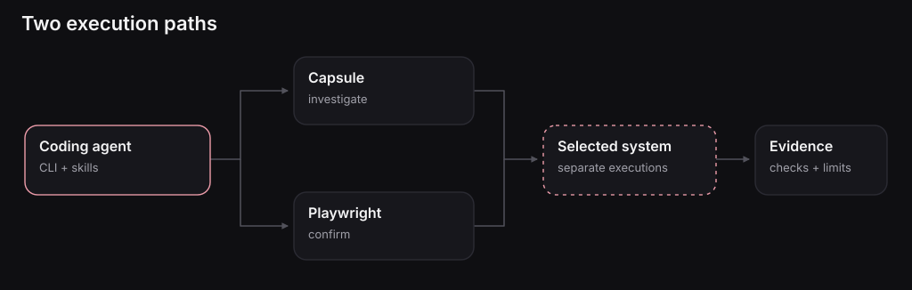

# Verification



Conceptual flow: it does not depict an automatically proven verdict.

Verification means checking an expected behavior against evidence. Blackbox supplies controlled execution, system-test integration, observation, and retained records so the coding agent can do that work.

The claim should come first: under these starting conditions, after this action, what must be true? The execution then produces evidence that can support, contradict, or leave that claim unanswered.

```text
Accepted expectation -----------------------+
                                            |
Known state -> action -> running system -> evidence -> check
```

## Verification is not the same as a green process

A request returning 201 establishes a response. A stored row needs a state read. A successful message send does not establish consumer completion. A clean report export says that a report was written, not that the system met its requirements.

For an automated check, preserve the assertion's actual outcome and the evidence it used. If an agent interprets raw observations without a recorded evaluator, label the result an agent assessment. Do not present it as a verdict emitted by Blackbox.

## Two ways to obtain evidence

Use a [Capsule](../capsules/index.md) for bounded experiments and investigations. Use [native Playwright](../playwright/index.md) for repeatable checks in fresh Sandboxes. The application and selected dependencies are real within the declared boundary; mocks or excluded external services must remain explicit.

## Scope of a conclusion

A result belongs to its requirement, input, selected system, revision, environment, and physical attempt. Passing one scenario does not establish every possible behavior, complete specification coverage, or production equivalence.

Changing internal code is not itself a failure. What matters is whether the required behavior still holds. Conversely, a correct-looking response does not excuse a forbidden side effect.

Read next: [Evidence sources](evidence.md), [behavioral evidence](behavioral-evidence.md), and [evidence qualification](evidence-qualification.md).

## Source contract

[Evidence interpretation contract](https://github.com/suites-dev/blackbox/blob/9197de5de456285af16e4dcbcf722082217a3989/packages/capsule/skills/capsule/references/evidence-and-reports.md).

## Pages in this section

- [Evidence sources](evidence.md)
- [Behavioral evidence](behavioral-evidence.md)
- [Runtime observations](runtime-observations.md)
- [Evidence qualification](evidence-qualification.md)
- [Limitations and causality](limitations-and-causality.md)
- [Completion barriers](completion-barriers.md)

---

[Documentation](../README.md)
