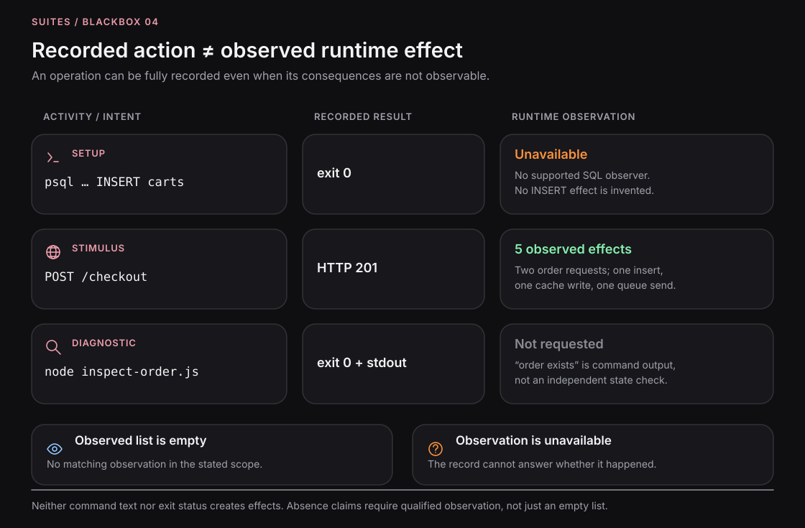

# Runtime observations

Instrumentation reports selected runtime operations. In the current Node provider these arrive as OpenTelemetry traces. The collector retains them with execution identity so they can be inspected alongside actions and explicit state checks.

## Activity versus observation

A Capsule Activity records an admitted command and its result. A runtime observation records what a compatible observer saw. Running `psql` successfully does not create an INSERT span in a separately instrumented Node application.

A command can therefore be recorded even when its downstream consequences are unobserved. Preserve that distinction instead of converting command text into effects.

*Concept illustration. The counts demonstrate the distinction; they are not a captured run or a promise that every operation is currently normalized.*

## OpenTelemetry and effects

OpenTelemetry is an observation source. An effect is a structured interpretation of supported observations for behavioral checks. Raw spans, normalized effects, state reads, and evaluator verdicts are different artifacts.

The baseline Playwright package exposes `telemetry` for raw reads and an `effects` evaluation handle. A handle existing in TypeScript does not prove an effect projector is installed. The incoming Gherkin v1 compiler still capability-gates effects claims. See [availability](../status.md).

## Scope and correlation

Inspect the exact execution first. Activity-level queries may omit relevant work that continued on a separate trace, especially across a shared-state handoff. A session-level view is broader, but membership in one session does not prove causation.

Do not count both a client span and its corresponding server span as two independent business requests without understanding the representation. Retried operations, duplicated exports, and missing attributes affect interpretation.

## Missing data

An empty observation list can mean no match in the selected scope, delayed export, unsupported instrumentation, or incomplete capture. A stopped collector does not establish business completion. Keep unknown and unavailable separate from a false result.

Next: [Instrumentation](../systems/instrumentation.md) · [Causality](limitations-and-causality.md).

## Source contract

[Node observer](https://github.com/suites-dev/blackbox/blob/9197de5de456285af16e4dcbcf722082217a3989/packages/instrumentation-runtime-node/README.md). [Playwright fixtures](https://github.com/suites-dev/blackbox/blob/9197de5de456285af16e4dcbcf722082217a3989/packages/playwright/README.md).

---

[Documentation](../README.md)
