# Releases

Blackbox uses fixed Lerna versions across every workspace package. `main` is the
published-history branch. A `release/**` branch is a temporary stabilization line,
and a `prepare-release/**` branch contains the reviewable version and changelog
change for one release.

GitHub accepts squash merges only. A pull request title must use Conventional
Commits syntax, and GitHub writes that title unchanged as the squash commit subject.
The title check runs when a pull request is opened, synchronized, reopened, or
edited, so changing the title always produces a new verdict.

```mermaid
flowchart LR
  M0["main<br/>last published tag"] --> R["release/version<br/>stabilize with reviewed PRs"]
  R --> P["prepare-release/version<br/>fixed versions and changelogs"]
  P -->|"squash PR"| R1["release/version<br/>validated candidate"]
  R1 -->|"final squash PR<br/>chore(release): version"| M1["main<br/>exact publish commit"]
  M1 --> T["signed annotated vX.Y.Z tag"]
  T --> S["verify tag, source, build, and tests"]
  S --> E["protected npm environment"]
  E --> N["Lerna publish from-package<br/>OIDC + provenance"]
  N --> G["GitHub Release"]
```



This squash-only shape is deliberate. The final release PR creates the commit that
will be tagged on `main`; a release tag is never placed on the temporary release
branch. Every later release branch starts from tagged `main`, so Lerna can find the
previous version without preserving a merge commit.

The repository is transitioning from its first alpha line. Until the first final
release PR lands, `release/v0.0.1-alpha` remains the default branch. After that PR is
merged, make `main` the default before starting another release line.

## Public package set

All directories discovered by `pnpm exec lerna list --all` are public packages.
Lerna resolves their dependency order and publishes the complete fixed-version set.
All packages:

- use the same version as `lerna.json`;
- publish with public access;
- include README, Apache-2.0 license, and NOTICE files;
- identify this repository and their package directory; and
- set `publishConfig.provenance` to `true`.

## Prepare a release

1. Start `release/<version>` from the current tagged `main`. For the first alpha,
   continue using `release/v0.0.1-alpha`.
2. Merge only reviewed pull requests into that line. Use a Conventional Commit PR
   title because the title becomes the squash commit subject and is the input Lerna
   reads when it recommends versions and generates changelogs.
3. Select the release branch in GitHub's workflow picker and run **Release Preview**
   for a read-only version proposal. The workflow checks out that dispatch's exact
   commit and runs Lerna locally without tagging, committing, or pushing.
4. Create `prepare-release/<version>` from the release branch. Apply the fixed version
   and changelog updates with Lerna, then refresh the lockfile. The first alpha uses:

   ```sh
   pnpm exec lerna version 0.0.1-alpha.0 \
     --force-publish \
     --no-git-tag-version \
     --no-push \
     --yes
   pnpm install --lockfile-only --ignore-scripts
   ```

5. Run the normal local checks:

   ```sh
   pnpm install --frozen-lockfile
   pnpm lint
   pnpm check:deps
   pnpm typecheck
   pnpm test
   ```

6. Open the preparation PR against the release branch. After it is green and merged,
   open the final PR from the release branch to `main`. Use
   `chore(release): <version>` as its title. The final PR must preserve the reviewed
   release tree; do not add fixes while merging it.

## Tag and publish

After the final release PR is squash-merged, create a signed, annotated tag on that
exact `main` commit and push it:

```sh
git switch main
git pull --ff-only
git tag --sign --annotate v0.0.1-alpha.0 --message "Blackbox v0.0.1-alpha.0"
git push origin v0.0.1-alpha.0
```

The immutable `v*` tag starts **Publish Release**. The workflow fails unless the tag:

- is annotated and has a signature GitHub reports as verified;
- resolves to the checked-out commit;
- matches every package version and `lerna.json`;
- is an ancestor of `origin/main`; and
- starts from a clean checkout.

The verification job runs lint, typecheck, and tests against the exact tag.

The publish job uses the reviewer-protected `npm` environment and GitHub OIDC. It has
`id-token: write` and runs `lerna publish from-package` with provenance enabled. No
long-lived npm token is used. Prereleases receive the `next` distribution tag;
stable releases receive `latest`. The workflow then creates the GitHub Release from
the immutable tag.

If a publish job is interrupted after some packages reach npm, manually dispatch the
same workflow with the existing tag. Lerna's `from-package` mode skips versions that
already exist and continues with unpublished packages. Never move a release tag or
overwrite a published version.

## External setup before the first publication

Repository code cannot establish npm ownership or trusted-publisher relationships.
Before pushing the first release tag:

1. Confirm the release owner can publish public packages under the `@suites` scope.
2. Configure npm trusted publishing for each package, using repository
   `suites-dev/blackbox`, workflow filename `publish-release.yml`, and environment
   `npm`. Explicitly allow direct `npm publish`; new publisher configurations
   otherwise default to staged-only publication.
3. Configure the GitHub `npm` environment with required reviewers and prevent the
   person who initiated a deployment from approving it.
4. Confirm the branch and tag rulesets still cover `main`, `release/**`, and `v*`,
   and that the required checks include CI, Capsule E2E, PR title, and security.

The first three items are release gates. All package names are new, and npm's trusted
publisher controls live in an existing package's settings. Confirm the available
first-publication bootstrap path before tagging. If npm cannot configure the OIDC
relationship before a package exists, stop and obtain separate owner authorization
for a one-time bootstrap; this workflow does not fall back to a token. A green source
PR does not prove registry authorization or allow publication without provenance.

## Repository enforcement

The following live GitHub settings were verified on 2026-09-28:

- only squash merging is enabled, with the PR title as the commit subject and no
  generated commit body;
- the protected-branch ruleset covers `main`, `release/**`, and the default branch,
  requires the CI, Capsule E2E, PR title, and security gates, and requires review and
  resolved conversations;
- the immutable-tag ruleset prevents updating or deleting `v*` tags; and
- the `npm` environment accepts only `v*` tags, requires approval from `qballer`,
  prevents self-review, and disables administrator bypass.

The PR title workflow includes the `edited` event. Correcting a title therefore
reruns the required Conventional Commit check before a squash merge can proceed.

## Hotfixes

Cut `release/<patch>` from the affected tag, merge the focused fix and a preparation
PR, then use the same final PR into `main`, tag, and publish sequence. If `main` has
advanced incompatibly, resolve that in the final PR and rerun every gate before
tagging. Ship a new version for every correction.

See [workspace packages](packages.md), [contributing](../../CONTRIBUTING.md), and
[security operations](security.md) for the surrounding maintenance contracts.
