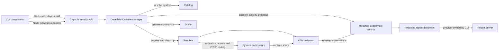

# Capsule

`@suites/blackbox-capsule-internal` is the private workspace package that provides
the runtime environment for investigations and owns their retained execution records
and report semantics. An experiment is the procedure carried out in a Capsule; it is
not a separate CLI object here. The [CLI](../cli/README.md) is the user-facing
composition layer.

Capsule is the implemented system-test path today. Playwright integration is future
work; it can reuse the Sandbox layer underneath, but this package does not currently
provide a Playwright adapter or runner.

## How The Pieces Fit



The main flow is:

1. [`startCapsule()`](src/session/start.ts) admits a session record, starts a detached
   manager, and follows retained progress until startup reaches a terminal state.
2. The manager loads `blackbox.config.yaml` through the
   [Catalog](../catalog/README.md), resolves one system into a sandbox plan, and asks
   the [Sandbox](../sandbox/README.md) to acquire only that plan's Compose resources.
3. Caller-supplied runtime activation adapters are converted into participant mounts
   and environment settings. The CLI currently supplies the Node adapters; Capsule
   depends only on the instrumentation activation contract.
4. Sandbox starts the packaged [OTel collector](../otel-collector/README.md), routes
   participant telemetry to it, and exposes its control endpoint. Capsule verifies
   required instrumentation activation before checking application readiness.
5. `execCapsule()` and `execCapsuleInteractive()` send activity requests to the
   manager. Raw commands run on the host; catalog drivers prepare traced host or
   participant-container commands. Outcomes, propagation status, bounded output,
   and activity root spans are retained with secret-aware redaction.
6. `reportCapsule()` validates the retained session, activity, progress, and
   observation artifacts, then projects one redacted `CapsuleReportDocument`. JSON,
   HTML, and served views are presentations of that document, not replacements for
   the retained evidence.

## Lifecycle Ownership

- The calling process admits the session and launches the manager. Progress sinks are
  presentation only; retained `progress.json` is authoritative even in silent mode.
- The detached manager owns the live Sandbox handle and its local socket. It
  serializes execution and stop requests, records state transitions, and requests
  cleanup. Startup failure cleans an acquired sandbox; stop retries cleanup after a
  recoverable manager failure.
- Sandbox owns Docker Compose acquisition, resource inspection, and bounded cleanup.
  Catalog owns configuration validation and resolution. Capsule coordinates both but
  does not absorb their responsibilities.
- The CLI owns flags, terminal rendering, runtime-adapter selection, export paths,
  and report-server composition. Capsule does not depend on the CLI or report server.
- A recorded `running` state is lifecycle history, not a manager heartbeat. Recovery
  uses process and socket-instance checks before reconciling a dead manager or
  cleaning resources.

Each session is retained below:

```text
.blackbox/experiments/capsule-<session-id>/
├── session.json       # lifecycle, ownership, resources, readiness, cleanup
├── activities.json    # admitted and completed execution activities
├── progress.json      # versioned startup progress document
└── sandbox/           # Sandbox records and collector telemetry storage
```

Session, activity, progress, and report schemas live in [`schema/`](schema/). Readers
validate identities and persisted shapes before projection. Reports redact known
credentials, sensitive arguments and output, environment values, and private IPC
paths; that redaction is a boundary, not a claim that arbitrary application payloads
can never contain secrets.

## Maintainer Map

| Area                      | Start here                                                                                                   | Responsibility                                                                                                  |
| ------------------------- | ------------------------------------------------------------------------------------------------------------ | --------------------------------------------------------------------------------------------------------------- |
| Public workspace contract | [`src/index.ts`](src/index.ts)                                                                               | Session operations, observation reads, report projection/rendering, registry, schemas, and types                |
| Session client            | [`src/session/`](src/session/)                                                                               | Admission, manager launch, IPC operations, validation, and failed-manager recovery                              |
| Manager orchestration     | [`src/manager/`](src/manager/)                                                                               | Catalog resolution, Sandbox acquisition, instrumentation verification, telemetry wiring, execution, and cleanup |
| Driver execution          | [`src/execution/`](src/execution/)                                                                           | Driver preparation, host/container execution, interactive control, output retention, and redaction              |
| Retained truth            | [`src/records.ts`](src/records.ts), [`src/progress/`](src/progress/), [`src/persistence/`](src/persistence/) | Atomic writes plus strict decoding of session, activity, and progress artifacts                                 |
| Reports                   | [`src/reporting/`](src/reporting/)                                                                           | Read-only observation projection, redaction, serialization, and standalone HTML rendering                       |

When an integration changes, keep the port boundary in
[`src/manager/ports.ts`](src/manager/ports.ts): production uses the Node-backed
Catalog, Sandbox, and collector-runtime ports, while manager tests substitute those
ports without Docker.

## Validate A Change

From the repository root after `pnpm install --frozen-lockfile`:

```sh
pnpm --filter @suites/blackbox-capsule-internal lint
pnpm --filter @suites/blackbox-capsule-internal build
pnpm --filter @suites/blackbox-capsule-internal test
pnpm exec prettier --check packages/capsule/README.md
```

These package checks do not prove the Docker-backed journey or cleanup behavior. Use
the repository's dedicated Capsule Bash E2E workflow when that integration evidence
is required; do not infer it from a green unit-test process.
