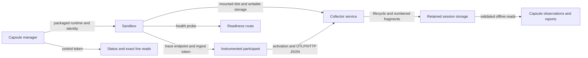

# Capsule OTLP Collector

`@suites/blackbox-otel-collector-internal` receives trace telemetry for one exact
Capsule session and execution, retains accepted requests as durable fragments, and
serves exact retained reads for Capsule status and reports.

This is a private, unpublished workspace package. It is runtime infrastructure for
[Capsule](../capsule/README.md) and [Sandbox](../sandbox/README.md), not a standalone
collector distribution or a public SDK.

## Where The Collector Fits



The integration is split across clear owners:

1. Capsule resolves [`packagedCollectorRuntime()`](src/runtime.ts) and passes the
   mounted Node runtime, session identity, limits, and generated split tokens to
   Sandbox.
2. Sandbox's [telemetry Compose override](../sandbox/src/telemetry/compose-override.ts)
   adds the collector service, a writable telemetry mount, its health check, and
   participant dependency and environment wiring.
3. Participant runtimes receive trace and activation endpoints plus the ingest
   token. Sandbox keeps the distinct control token for status inspection.
4. Capsule's [activation verification](../capsule/src/manager/activation/verification.ts)
   checks required runtime activation before Capsule proceeds to application
   readiness.
5. Capsule's [observation readers](../capsule/src/session/observations.ts) read the
   retained files directly, including after the collector process has stopped.

The executable [`src/main.ts`](src/main.ts) is configured by Sandbox. Maintainers
normally change this package and its integration points rather than launching the
binary by hand.

## Ingest To Exact Reads

```text
POST JSON trace request
  -> authenticate and validate the bounded request
  -> durably write fragments/000000000001.json
  -> durably update collector-lifecycle.json
  -> acknowledge with HTTP 200 and {}
  -> later validate the retained inventory
  -> project the exact session, activity, or trace requested
```

[`RunningCollectorStore`](src/lifecycle/running-store.ts) serializes writes. A trace
request is acknowledged only after both its numbered fragment and the updated
lifecycle counters are durable. A fragment retains the decompressed raw JSON text,
its original content-encoding fact, receive time, sequence, identity, and validated
span count. Derived trace and activity views never replace the source fragments.

Storage is scoped by exact identity:

```text
<storage-directory>/<session-id>/<execution-id>/
├── collector-lifecycle.json
├── collector.lock
├── collector-locks/
└── fragments/
    ├── 000000000001.json
    └── 000000000002.json
```

The storage lease prevents concurrent owners of that identity. Retention is bounded
by configured byte and fragment limits; the collector does not evict old fragments.
When the next fragment would exceed a limit, that request is rejected before the
fragment is written, the receiver records a failure, and existing retained evidence
remains in place.

On restart, the collector appends a new run to the lifecycle and continues fragment
sequence numbers. If the previous run has no graceful close record, it is retained
as `interrupted`. Graceful close drains HTTP work within the configured timeout,
records the final lifecycle state, and releases the lease.

## Transport And Read Contract

The trace receiver deliberately supports a narrow transport surface:

- `POST` with `Content-Type: application/json` at the configured trace path.
- Identity and gzip content encodings, with request and decompressed-size bounds.
- OTLP JSON trace requests only, returning the empty JSON object on success.
- No protobuf binary, gRPC, metrics, logs, or profiles.

The configured bearer tokens have separate authority. The ingest token authorizes
trace intake and activation. The control token authorizes live status and retained
session, activity, and trace reads. The readiness route is unauthenticated and
returns no retained data.

The package root exports `startCollector()`, the packaged-runtime descriptor,
schemas and types, and retained readers including `readCollectorSession()`,
`readCollectorActivity()`, `readCollectorTrace()`, `readCollectorTraces()`, and
`readCollectorSnapshot()`. See [`src/index.ts`](src/index.ts) for the authoritative
surface. Readers validate identity, lifecycle shape, fragment contents, sequence,
and the inventory needed to support acknowledged counts. Results distinguish
`found`, `missing`, and `corrupt`; callers must not turn missing or corrupt evidence
into an empty successful observation.

## Readiness, Activation, And Receipt Are Different Facts

| Signal                      | What it establishes                                                                | What it does not establish                       |
| --------------------------- | ---------------------------------------------------------------------------------- | ------------------------------------------------ |
| Receiver `ready`            | The HTTP listener and durable store are available.                                 | Participant instrumentation ran.                 |
| Instrumentation `activated` | A runtime and service activation for the exact session and execution was retained. | Any trace request arrived.                       |
| Telemetry `received`        | At least one validated request was durably accepted and counted.                   | Every expected span arrived or export completed. |

These signals are evidence, not assurance conclusions. The collector does not know
how many spans an application should have emitted, so shutdown cannot claim capture
completeness. It preserves received span links and exact identifiers, but it does
not inject propagation, infer causality, or prove that linked work occurred. Capsule
and report layers may present these facts; they must preserve those limits.

## Maintainer Map

| Area               | Start here                                                                 | Responsibility                                                        |
| ------------------ | -------------------------------------------------------------------------- | --------------------------------------------------------------------- |
| Exported contract  | [`src/index.ts`](src/index.ts), [`src/model/types.ts`](src/model/types.ts) | Internal API, lifecycle states, tagged read results, and schemas      |
| Process entrypoint | [`src/main.ts`](src/main.ts), [`src/runtime.ts`](src/runtime.ts)           | Environment decoding, packaged runtime, signal-driven shutdown        |
| HTTP boundary      | [`src/transport/`](src/transport/)                                         | Routing, split authorization, bounded decoding, responses, live reads |
| OTLP JSON handling | [`src/otlp/json.ts`](src/otlp/json.ts)                                     | Validation, trace/activity filtering, trace partitioning              |
| Durable lifecycle  | [`src/lifecycle/`](src/lifecycle/)                                         | Serialized acceptance, activation, restart, drain, failure, retention |
| Storage and reads  | [`src/storage/`](src/storage/)                                             | Lease ownership, atomic JSON writes, exact reads and projections      |
| Persisted schemas  | [`schema/`](schema/)                                                       | Fragment, activation, and lifecycle JSON contracts                    |

Changes to acceptance ordering, counters, schemas, paths, or read projections are
storage-contract changes. Update the writer, strict readers, schemas, and relevant
integration tests together. Changes to environment names or endpoint behavior also
require checking both Sandbox telemetry wiring and Capsule activation/status use.

## Validate A Change

From the repository root after `pnpm install --frozen-lockfile`:

```sh
pnpm --filter @suites/blackbox-otel-collector-internal lint
pnpm --filter @suites/blackbox-otel-collector-internal build
pnpm --filter @suites/blackbox-otel-collector-internal test
pnpm exec prettier --check packages/otel-collector/README.md
```

Package tests cover the receiver, activation, storage, retention, restart, lease,
and exact-reader contracts. They do not prove Capsule's Docker-backed wiring or
cleanup; use the repository's dedicated Capsule Bash E2E lane when that integration
evidence is required.
