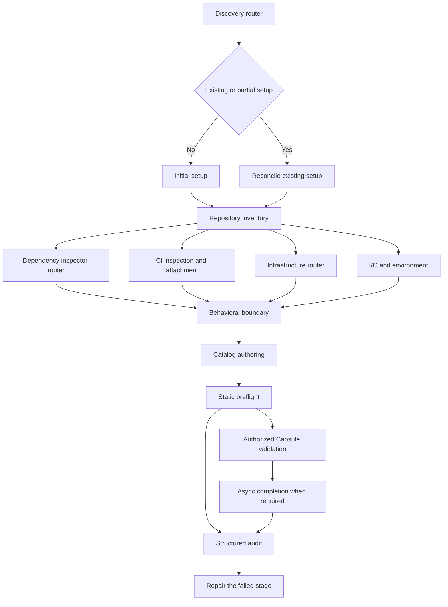
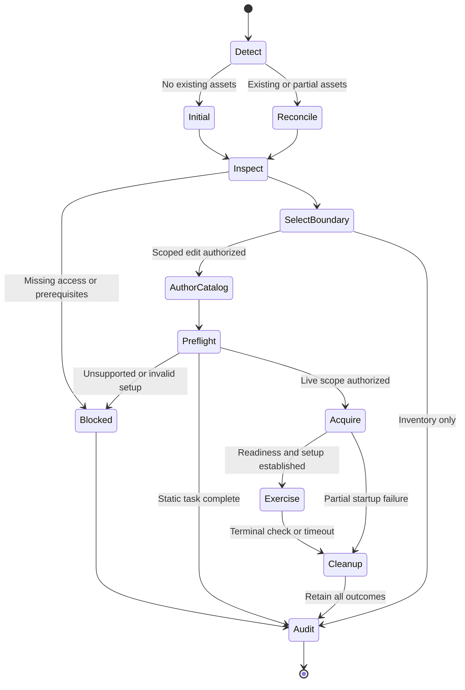
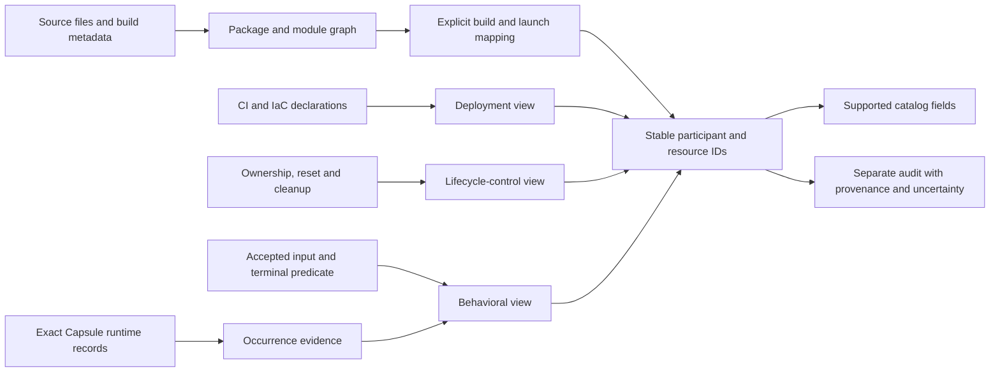
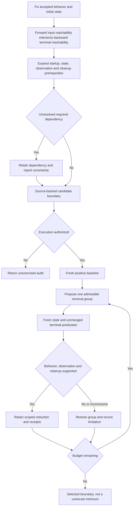
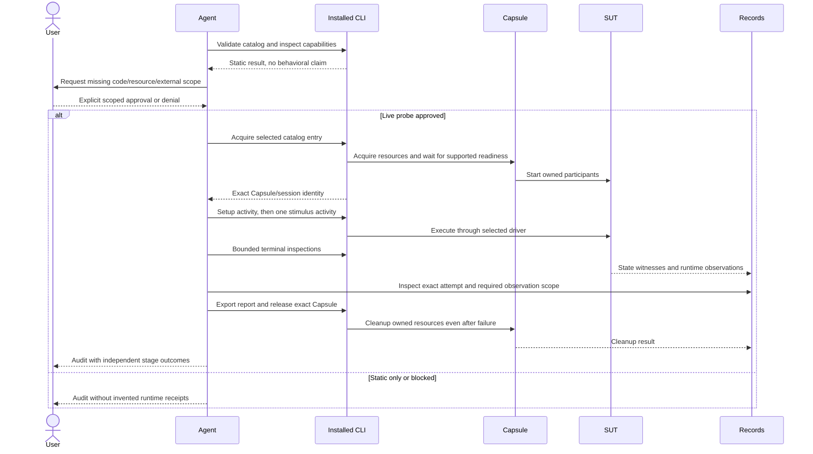
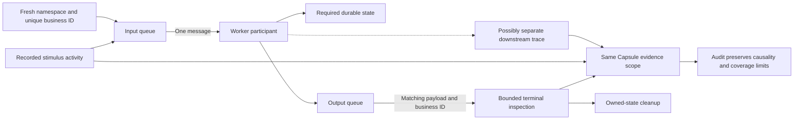
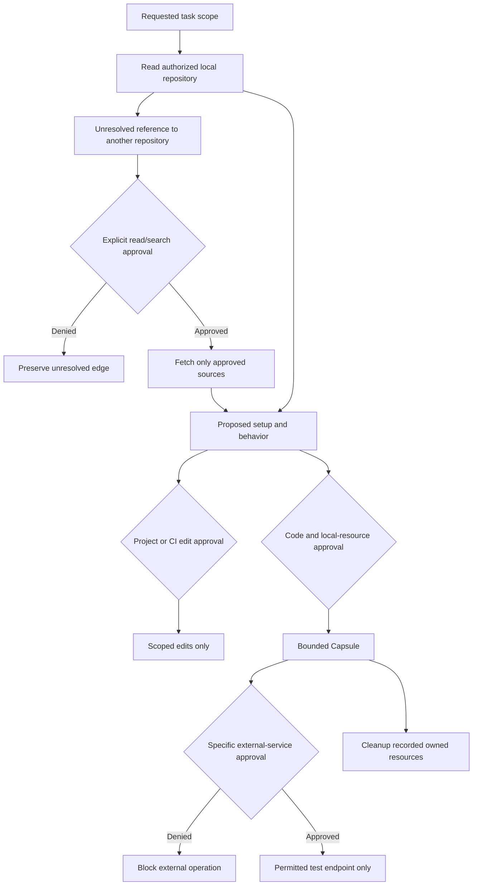
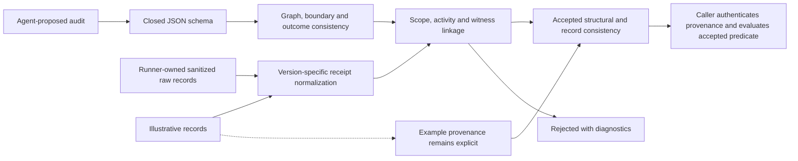

# Discovery diagrams

Mermaid sources are provided separately and repeated here for Markdown rendering.

## Skill router
[Source](skill-router.mmd)

## Discovery state
[Source](discovery-state.mmd)

## Evidence model
[Source](evidence-model.mmd)

## Sut reduction
[Source](sut-reduction.mmd)

## Capsule sequence
[Source](capsule-sequence.mmd)

## Queue flow
[Source](queue-flow.mmd)

## Permission boundaries
[Source](permission-boundaries.mmd)

## Audit pipeline
[Source](audit-pipeline.mmd)

